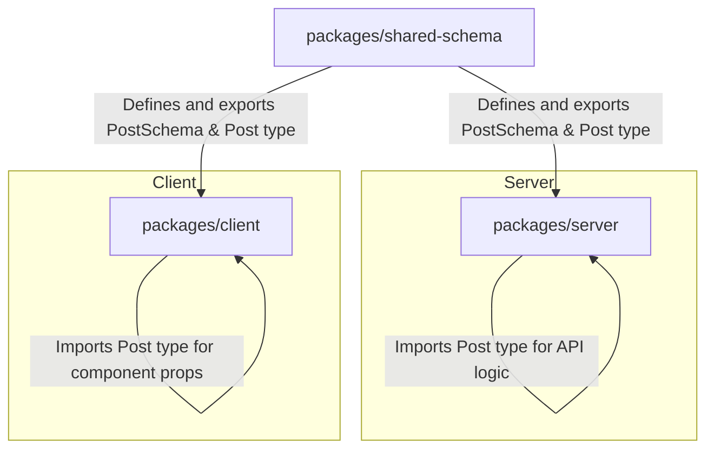
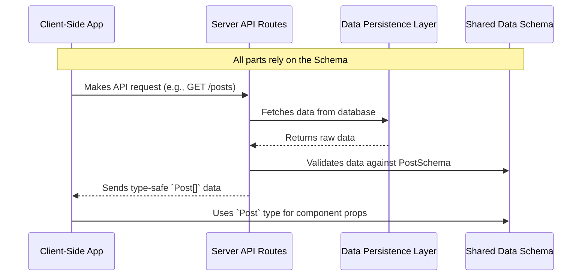

# Chapter 1: Shared Data Schema

Welcome to the documentation for the `learning` project! This first chapter establishes the most critical architectural concept of our application: the **Shared Data Schema**. This is the bedrock upon which we will build a robust, type-safe, and maintainable full-stack application.

---

### Problem & Motivation

In modern web development, a common source of bugs and friction occurs at the boundary between the server (backend) and the client (frontend). The server might change the shape of the data it sends—for instance, renaming a field from `author` to `authorName`. If the client isn't updated simultaneously, it will try to access a property that no longer exists, leading to runtime errors and a broken user interface. This disconnect forces developers to manually keep types synchronized, a process that is tedious and highly error-prone.

This project solves that problem by creating a **single source of truth** for all data structures. We define the shape of our data *once* in a shared location, and both the server and client import their types from this central package. If we change the `author` field to `authorName` in our shared schema, the TypeScript compiler will immediately alert us to every single place in both the client and server codebase that needs to be updated. This eliminates an entire class of bugs before the code is ever run.

Our guiding use case for this chapter will be a simple `Post` object. We need to define its structure—what fields it contains, like an `id`, `title`, and `content`. We will then see how this single definition is used by our server to send `Post` data and by our client to correctly display it, all with guaranteed type safety.

### Core Concept Explanation

The **Shared Data Schema** is a collection of definitions that act as a formal contract for the shape of data flowing through our application. Think of it as a blueprint for a house. Before construction begins, everyone—the architect, the builder, the plumber—agrees to follow the same blueprint. This ensures the walls align, the pipes fit, and the windows are placed correctly. Without the blueprint, chaos would ensue. Our schema is the blueprint for our data.

In our project, this is implemented as a dedicated package within our monorepo, `packages/shared-schema`. This package doesn't contain any application logic; its sole purpose is to define and export data structures. We use **Zod**, a TypeScript-first schema declaration and validation library, to create these definitions. Zod allows us to define a schema and then *infer* the static TypeScript type directly from it. This is incredibly powerful because we only have to write the definition once.

The core principle at play is the **Single Source of Truth (SSoT)**. By centralizing our data definitions, we ensure consistency and reliability. When the server promises to send a `Post`, the client knows *exactly* what fields and types to expect because both are referencing the identical "blueprint." This approach drastically improves developer confidence, speeds up development, and creates a more resilient application.

---

### Practical Usage Examples

Let's apply this concept to our `Post` use case. We'll start by defining the schema and then see how both the server and client can use it.

#### 1. Defining the Schema

First, we define the structure of a `Post` in our shared package. We specify that it must have a string `id`, `title`, and `content`.

**File**: `packages/shared-schema/src/post.ts`
```typescript
import { z } from 'zod';

export const PostSchema = z.object({
  id: z.string().uuid(),
  title: z.string(),
  content: z.string(),
});
```
*   **Explanation**: We use Zod's `z.object()` to define the shape. Each key corresponds to a field, and its value is a Zod validator (e.g., `z.string()`).

#### 2. Inferring the TypeScript Type

We don't need to manually write a `Post` interface. We can infer it directly from the Zod schema.

**File**: `packages/shared-schema/src/post.ts`
```typescript
import { z } from 'zod';

// (PostSchema from above)
export const PostSchema = z.object({
  id: z.string().uuid(),
  title: z.string(),
  content: z.string(),
});

export type Post = z.infer<typeof PostSchema>;
```
*   **Explanation**: `z.infer` is a Zod utility that creates a static TypeScript type from a schema. `Post` is now a reusable type that perfectly matches our schema definition.

#### 3. Using the Type on the Server

Our server can now import the `Post` type to ensure the data it handles conforms to the contract.

**File**: `packages/server/src/services/post-service.ts`
```typescript
import { Post } from 'shared-schema'; // Import from shared package
import { v4 as uuidv4 } from 'uuid';

export function createPost(title: string, content: string): Post {
  return {
    id: uuidv4(),
    title,
    content,
  };
}
```
*   **Explanation**: The `createPost` function's return type is explicitly set to `Post`. TypeScript will throw an error if this function tries to return an object that doesn't match the shared `Post` structure.

#### 4. Using the Type on the Client

Similarly, the React frontend imports the same `Post` type to define the props for a component that displays a post.

**File**: `packages/client/src/components/PostCard.tsx`
```typescript
import { Post } from 'shared-schema'; // Import from shared package

interface PostCardProps {
  post: Post;
}

export function PostCard({ post }: PostCardProps) {
  // Component implementation...
  return <div>{post.title}</div>;
}
```
*   **Explanation**: The component's props are typed with `Post`. If we tried to access `post.author`, TypeScript would show an error because that field doesn't exist in our shared definition.

---

### Internal Implementation Walkthrough

The ability to share code seamlessly between the client and server is made possible by our project's **monorepo architecture**, managed by a tool like pnpm workspaces.

A monorepo is a single repository that contains multiple distinct projects or packages. Our file structure looks something like this:

```
learning/
├── packages/
│   ├── client/         # The React frontend
│   ├── server/         # The server-side API
│   └── shared-schema/  # Our shared data definitions
└── package.json
```

The `client` and `server` packages list `shared-schema` as a dependency in their respective `package.json` files. The package manager creates symbolic links, allowing us to import from `shared-schema` as if it were a third-party library from `node_modules`.

The flow of information is simple but powerful:



When you run the application, the TypeScript compiler for the server and the bundler (like Vite or Webpack) for the client both resolve the `import { Post } from 'shared-schema'` statement by looking inside the `packages/shared-schema` directory. This unified dependency management is the key to maintaining a single source of truth.

### System Integration

The `Shared Data Schema` is the central hub that connects almost every other part of our system. Its influence is felt across the entire stack.



*   **[Server API Routes](chapter_05.md)**: The API uses Zod schemas to validate incoming request data (bodies, params) and to ensure outgoing responses adhere to the defined structures.
*   **[Data Persistence Layer](chapter_04.md)**: The types inferred from our schemas are used to model the data stored in the database, ensuring consistency between our application logic and our stored data.
*   **[Client-Side Data Fetching Client](chapter_06.md)**: The client's data fetching hooks are typed with our shared types. This gives us autocompletion and type-checking when handling API responses.
*   **[Page Components](chapter_07.md)**: React components use the shared types for their props, making the UI robust and preventing errors when rendering data.

---

### Best Practices & Tips

*   **Keep Schemas Pure**: The `shared-schema` package should *only* contain data definitions (schemas, types, enums). Avoid placing any business logic, React components, or server-specific code here.
*   **Start Small, Extend Later**: Define your schemas with only the essential fields first. You can always extend them later. This keeps the initial design clean and focused.
*   **Avoid Default Exports**: Use named exports (`export const PostSchema`) instead of default exports. This makes imports more explicit and less prone to naming confusion.
*   **Common Pitfall**: A common mistake is to define a type manually on the client or server that *should* have come from the shared package. Always ask yourself, "Will this data structure be sent over the network?" If the answer is yes, it belongs in the `shared-schema`.

### Chapter Conclusion

You have now learned about the foundational pillar of our application's architecture: the **Shared Data Schema**. It is the single source of truth that guarantees type safety and consistency between our server and client. By defining data structures in one central, shared location, we eliminate a major source of bugs, improve developer productivity, and build a more reliable system.

With our data "blueprint" now established, we can turn our attention to the visual "blueprint" of our application. The next chapter will cover how we create a consistent look and feel across our user interface.

Next up: **[Application Theming](chapter_02.md)**