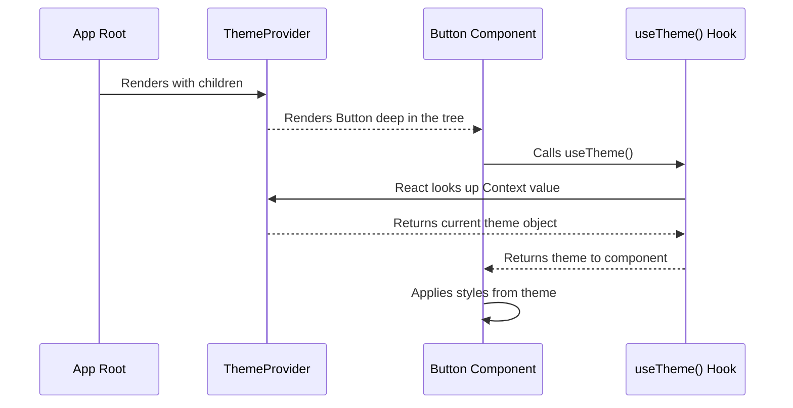

# Chapter 2: Application Theming

In the [Shared Data Schema](chapter_01.md), we established a single source of truth for the *structure* of our data. This ensures consistency between the client and server. Now, we'll address a similar challenge on the frontend: ensuring visual consistency across our entire user interface. This chapter introduces the Application Theming system, our single source of truth for all visual styles.

---

### Problem & Motivation

Imagine building an application with hundreds of components. If you define colors, fonts, and spacing directly inside each component, your codebase becomes a tangled mess of hardcoded values. What happens when the primary brand color needs to change from blue to green? You would have to hunt down and replace every instance of `#0000FF` with `#008000`—a tedious and error-prone process.

This problem becomes even more complex when introducing features like a "dark mode." You would need to add conditional logic inside every single component to switch between light and dark colors, bloating your code and making maintenance a nightmare. The core problem is the lack of a centralized system for managing design decisions.

Our **Application Theming** system solves this by abstracting all design tokens (colors, fonts, spacing, etc.) into a single, consumable object. This allows us to make a global style change in one place and have it instantly propagate throughout the entire application. For this chapter, our guiding use case will be to build a simple `Button` component that can automatically adapt its appearance for both light and dark themes without any internal logic changes.

### Core Concept Explanation

The theming system is built on two core concepts: the **Theme Object** and the **Theme Provider**.

A **Theme Object** is a plain JavaScript object that acts as a dictionary for your design system. It holds all the stylistic values your application will use. Instead of referencing a hex code like `#FFFFFF`, a component will reference a theme property like `theme.colors.background`. This indirection is the key to making the system flexible.

```javascript
// A simplified theme object
const lightTheme = {
  colors: {
    background: '#FFFFFF',
    text: '#111111',
    primary: '#007AFF',
  },
};
```

The **Theme Provider** is a special React component that wraps your entire application. It uses React's Context API to make the `Theme Object` available to every component in the component tree, no matter how deeply nested. Think of it as a central broadcasting station that sends the current theme information to any component that "tunes in."

This setup allows us to easily switch themes. For instance, to enable dark mode, we simply tell the `ThemeProvider` to broadcast a different theme object (e.g., `darkTheme`). Every component listening for theme changes will automatically receive the new values and re-render with the updated styles. This powerful pattern decouples our components from specific style values, making them reusable and adaptable.

---

### Practical Usage Examples

Let's build our theme-aware `Button` component using this system.

#### 1. Defining the Themes

First, we create a file to define our theme objects. For this project, this could live in `client/src/theme/themes.ts`. We'll define both a `light` and a `dark` theme to support both modes.

```typescript
// client/src/theme/themes.ts
export const lightTheme = {
  colors: {
    background: '#ffffff',
    text: '#121212',
    primary: '#007bff',
  },
};

export const darkTheme = {
  colors: {
    background: '#121212',
    text: '#ffffff',
    primary: '#007bff',
  },
};
```
*   **Explanation**: We've created two simple objects. Notice how the `background` and `text` colors are inverted, but `primary` remains the same. This is the central source of truth for our color schemes.

#### 2. Creating the ThemeProvider

Next, we'll create a `ThemeProvider` component. This component will manage which theme is currently active and provide it to all its children.

```typescript
// client/src/theme/ThemeProvider.tsx
import React, { createContext, useState, useContext } from 'react';
import { lightTheme } from './themes'; // Assuming dark theme logic comes later

const ThemeContext = createContext(lightTheme);

export const useTheme = () => useContext(ThemeContext);

export const ThemeProvider = ({ children }) => {
  // Logic to switch themes would go here
  const [theme] = useState(lightTheme);
  return (
    <ThemeContext.Provider value={theme}>
      {children}
    </ThemeContext.Provider>
  );
};
```
*   **Explanation**: We create a `ThemeContext` and a custom `useTheme` hook. The hook is a clean way for our components to access the theme without needing to know about `useContext`. The `ThemeProvider` component uses the `Provider` to pass down the current `theme` object.

#### 3. Wrapping the Application

To make the theme available everywhere, we wrap our root application component with the `ThemeProvider`. This is typically done in `client/src/App.tsx` or `client/src/main.tsx`.

```typescript
// client/src/App.tsx
import { ThemeProvider } from './theme/ThemeProvider';
import { MyPageComponent } from './pages/MyPageComponent';

function App() {
  return (
    <ThemeProvider>
      <MyPageComponent />
    </ThemeProvider>
  );
}
```
*   **Explanation**: Now, `MyPageComponent` and any component rendered inside it can access the theme using our `useTheme` hook.

#### 4. Consuming the Theme in a Component

Finally, let's create our `Button` component. It will use the `useTheme` hook to get the current theme and style itself accordingly. We'll use inline styles here for simplicity, but in a real app, this would likely be done with a CSS-in-JS library.

```typescript
// client/src/components/ui/Button.tsx
import React from 'react';
import { useTheme } from '../../theme/ThemeProvider';

export const Button = ({ children }) => {
  const theme = useTheme();

  const style = {
    backgroundColor: theme.colors.primary,
    color: theme.colors.background,
    padding: '10px 15px',
    border: 'none',
    borderRadius: '4px',
  };

  return <button style={style}>{children}</button>;
};
```
*   **Expected Behavior**: This button will render with a blue background and white text. If we were to switch the `ThemeProvider` to use `darkTheme`, the button's appearance would not change, because `primary` and `background` colors are defined to provide good contrast in the `lightTheme`. The page's background and text would change, however.

### Internal Implementation Walkthrough

When a theme-aware component renders, a simple but powerful sequence of events occurs, managed by React's Context API. Let's trace the data flow.

1.  **Provider Initialization**: The `<ThemeProvider>` component is rendered at the top of the application tree. It puts the `lightTheme` object into its `ThemeContext.Provider`.
2.  **Component Rendering**: A `Button` component, nested deep within the application, begins to render.
3.  **Hook Invocation**: The `Button` calls the `useTheme()` hook.
4.  **Context Lookup**: The `useTheme()` hook internally calls React's `useContext(ThemeContext)`. React then travels up the component tree from the `Button` until it finds the nearest `ThemeContext.Provider`.
5.  **Value Retrieval**: React finds our `ThemeProvider` and retrieves the `value` prop that was passed to it—the `lightTheme` object.
6.  **Style Application**: The `useTheme()` hook returns the `lightTheme` object. The `Button` then uses properties from this object (e.g., `theme.colors.primary`) to define its styles and completes its render.

This entire process is incredibly efficient and is the core mechanism that makes theming possible in React.



---

### System Integration

The Application Theming system is a foundational layer that directly supports several other parts of our project architecture.

*   **[Reusable UI Component System](chapter_03.md)**: This is the most direct consumer. Every component in our UI library, from buttons to inputs to cards, will be "theme-aware." They will all source their stylistic properties from the `useTheme` hook, guaranteeing a consistent look and feel.
*   **[Page Components](chapter_07.md)**: Pages will be built by composing these theme-aware UI components. This ensures that entire views automatically adhere to the active theme without any page-specific styling logic.
*   **[Client Application Root](chapter_08.md)**: The root of our client application is responsible for instantiating the `ThemeProvider` and wrapping the entire component tree, making the theme globally available.

This system acts as the stylistic backbone, ensuring that as we build more complex components and pages, our application's visual identity remains cohesive and easy to manage.

### Best Practices & Tips

*   **Centralize Theme Definitions**: Keep all theme objects (`lightTheme`, `darkTheme`, etc.) in a dedicated directory like `client/src/theme`. This makes it easy to find and modify design tokens.
*   **Create a Custom `useTheme` Hook**: Always access the theme context through a custom hook (`useTheme`). This decouples your components from the specific context implementation and gives you a single place to add logic in the future.
*   **Keep Theme Objects Serializable**: Ensure theme objects only contain data that can be serialized (strings, numbers). Avoid functions or complex objects, as this keeps the theme simple and predictable.
*   **Avoid One-Off Values**: If you find yourself hardcoding a color or font size in a component, stop and consider if it should be added to the theme object instead. The goal is to eliminate "magic numbers" from your component styling.

### Chapter Conclusion

In this chapter, we have designed and implemented a robust, scalable system for managing application-wide visual styles. By centralizing our design tokens in theme objects and making them available through a `ThemeProvider`, we've decoupled our components from hardcoded styles. This not only enforces a consistent UI but also makes global design changes and features like dark mode incredibly simple to implement.

With this stylistic foundation in place, we are now perfectly positioned to build a library of components that can leverage it.

**Next**: We will use our new theming system to build a set of consistent and flexible components in the [Reusable UI Component System](chapter_03.md).