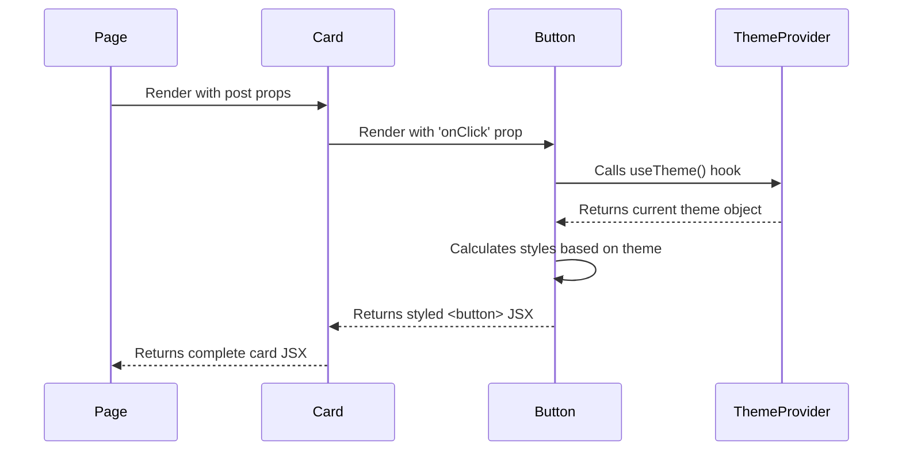

# Chapter 3: Reusable UI Component System

In the previous chapter on [Application Theming](chapter_02.md), we established a consistent visual language for our project, defining colors, fonts, and spacing. This provides the *palette* for our user interface. Now, we need the *building blocks* themselves. This chapter introduces the Reusable UI Component System, a library of fundamental UI elements that will use our theme to construct every part of the client-side application.

---

### Problem & Motivation

Imagine building a large application without a standardized set of UI elements. On the user profile page, a developer creates a button with rounded corners and a blue background. Later, on the settings page, another developer needs a button and creates one with sharp corners and a slightly different shade of blue. A third developer adds a button to a confirmation dialog that is green. The result is a messy, inconsistent user experience that looks unprofessional and is confusing for users.

This inconsistency also creates a maintenance nightmare. If the project's branding changes and all primary buttons need to be purple, developers would have to hunt down every single button instance across the entire codebase and update them individually. This process is slow, error-prone, and inefficient. The core problem is the lack of a single, authoritative source for fundamental UI elements. Our Reusable UI Component System solves this by providing a centralized library of components like `Button`, `Card`, and `Input`, ensuring that every instance is visually consistent and easy to update.

For this chapter, we will follow a concrete use case: building a simple `Card` component to display a summary of a blog post. This card will contain a title, a short snippet of text, and a "Read More" `Button`. This example will demonstrate how we create small, reusable components and then *compose* them to build more complex UI structures.

### Core Concept Explanation

A **UI Component System** is a collection of self-contained, reusable pieces of code that render a part of the user interface. Think of them like Lego bricks. You don't create a new plastic formula and mold for every single piece you need in your Lego castle; instead, you use a set of standard, predefined bricks (2x4 red, 1x2 blue, etc.) and combine them in creative ways. Our components work the same way. We define a `Button` once and reuse it everywhere.

The key principles behind our component system are:

*   **Encapsulation:** Each component bundles its own structure (HTML via JSX), styling, and behavior (JavaScript logic). A `Button` component knows how to look and act like a button. It doesn't need to know anything about the page it's on, making it highly portable.
*   **Reusability:** Once created, a component like `Card` or `Input` can be imported and used in any part of the application. This drastically speeds up development, as we are assembling UIs from existing parts rather than building from scratch.
*   **Composition:** We build complex UIs by combining simpler components. Our `PostCard` component, for instance, is not a single monolithic block of code. Instead, it is *composed* of text elements and a `Button` component. This makes the overall structure easier to understand, test, and maintain.
*   **Customization via Props:** Components are customized using "props" (short for properties). Props are like arguments passed to a function. For our `Button` component, we can pass a `label` prop to set its text and an `onClick` prop to define its action. This allows a single component to be flexible enough for many different contexts.

### Practical Usage Examples

Let's build the components needed for our motivating use case: displaying a blog post summary in a `Card`.

#### 1. Creating a Basic `Button` Component

First, we need the "Read More" button. This component will be the simplest building block. It needs to accept text to display and a function to call when clicked.

```typescript
// src/client/components/Button.tsx

import React from 'react';

interface ButtonProps {
  children: React.ReactNode;
  onClick: () => void;
}

export const Button: React.FC<ButtonProps> = ({ children, onClick }) => {
  return (
    <button onClick={onClick} className="button-primary">
      {children}
    </button>
  );
};
```

*   **Explanation:** We've defined a `Button` component that takes `children` (the content inside the button, like text) and an `onClick` handler as props. The styling is managed by a CSS class, which would use variables from our [Application Theming](chapter_02.md) system.

#### 2. Using the `Button` Component

Now, we can use this `Button` anywhere. Here’s how you would import and render it.

```typescript
// In another component file

import { Button } from './Button';

const App = () => {
  const handleReadMore = () => alert('Button clicked!');
  
  return (
    <Button onClick={handleReadMore}>
      Read More
    </Button>
  );
};
```

*   **Expected Behavior:** This will render a clickable button on the screen. When you click it, an alert box with the message "Button clicked!" will appear.

#### 3. Creating the `Card` Component

Next, let's create the `Card` component. It will act as a container for our post's title, content, and the `Button` we just made. This demonstrates composition.

```typescript
// src/client/components/Card.tsx

import React from 'react';
import { Button } from './Button';

interface CardProps {
  title: string;
  content: string;
}

export const Card: React.FC<CardProps> = ({ title, content }) => {
  return (
    <div className="card-container">
      <h2>{title}</h2>
      <p>{content}</p>
      <Button onClick={() => console.log('Viewing post...')}>
        Read More
      </Button>
    </div>
  );
};
```

*   **Explanation:** The `Card` component takes a `title` and `content` string as props. Inside its structure, it renders these props and, importantly, *composes* our `Button` component.

#### 4. Assembling the Final UI

Finally, a parent component (like a page) would use the `Card` to display actual post data.

```typescript
// src/client/pages/BlogPage.tsx

import { Card } from '../components/Card';

const postData = {
  title: 'Understanding Component Systems',
  content: 'Components are the building blocks of modern UIs...'
};

const BlogPage = () => {
  return (
    <Card 
      title={postData.title}
      content={postData.content}
    />
  );
};
```

*   **Expected Behavior:** This code renders our complete card, displaying the title, content, and the reusable "Read More" button, all neatly encapsulated.

---

### Internal Implementation Walkthrough

Let's look deeper at how a component like `Button` is implemented to integrate with our theming system.

1.  **Define Props with TypeScript:** We start by defining a strict type for the component's props. This ensures type safety and serves as self-documentation.
    *Code Reference:* `src/client/components/Button.tsx`
    ```typescript
    interface ButtonProps {
      children: React.ReactNode;
      onClick: () => void;
      variant?: 'primary' | 'secondary'; // Optional variant
    }
    ```

2.  **Access the Theme:** The component should not hardcode colors. Instead, it uses the `useTheme` hook provided by our [Application Theming](chapter_02.md) system to access the current theme's values (e.g., for light or dark mode).
    *Code Reference:* `src/client/components/Button.tsx`
    ```typescript
    import { useTheme } from '../theme/ThemeProvider';
    
    // Inside the component function...
    const { theme } = useTheme(); 
    ```

3.  **Apply Dynamic Styles:** Using the theme object, we can create a style object that dynamically sets properties like `backgroundColor` and `color` based on the theme and the `variant` prop.
    *Code Reference:* `src/client/components/Button.tsx`
    ```typescript
    const styles = {
      backgroundColor: variant === 'primary' 
        ? theme.colors.primary 
        : theme.colors.secondary,
      color: theme.colors.textOnPrimary,
      // ...other styles
    };
    ```

4.  **Render the Final Element:** The component returns a standard HTML `<button>` element, applying the props and dynamic styles.
    *Code Reference:* `src/client/components/Button.tsx`
    ```typescript
    return (
      <button onClick={onClick} style={styles}>
        {children}
      </button>
    );
    ```

This flow shows how a component remains self-contained while still being fully integrated into the application's global design system.



### System Integration

Our component system is not an island; it's a central hub that connects several other parts of the application architecture.

*   **[Shared Data Schema](chapter_01.md):** While our simple `Card` used basic `string` props, more complex components will receive data that conforms to our shared schema. For example, a `UserProfileCard` component would expect a `user` prop typed with the `User` schema, ensuring data consistency from the server to the final pixel.

*   **[Application Theming](chapter_02.md):** As shown above, components are the primary *consumers* of the theming system. They use the `useTheme` hook to dynamically style themselves, ensuring a consistent look and feel and allowing for features like light/dark mode switching without any changes to the components themselves.

*   **[Page Components](chapter_07.md):** Page components are the assemblers. They are responsible for fetching data and arranging our reusable UI components into meaningful layouts that users interact with. A `HomePage` might compose a `Header`, a `PostList` (which in turn maps over `Card` components), and a `Footer`.

### Best Practices & Tips

*   **Keep Components Focused:** A component should have a single responsibility. A `Button` should be a button. It shouldn't contain application-specific logic about what happens when it's clicked. That logic belongs in the parent page component.
*   **Prioritize Prop Clarity:** Use descriptive prop names and strong TypeScript interfaces. This makes your components easier for other developers (or your future self) to use correctly.
*   **Separate Container and Presentational Components:** For more complex scenarios, consider splitting components into two types. "Presentational" components (like our `Button`) only care about how things look. "Container" components manage logic and state, then pass data down to presentational ones.
*   **Avoid Margin on Components:** To make components more reusable, avoid adding `margin` to their root element. Margin is about the space *between* elements, which should be controlled by the parent layout component (e.g., using Flexbox `gap` or CSS Grid). This prevents unexpected spacing issues when you reuse a component in a new context.

---

### Chapter Conclusion

In this chapter, we established the foundation of our user interface: a library of reusable, theme-aware UI components. We learned that by breaking our UI down into small, composable pieces like `Button` and `Card`, we can build complex interfaces faster and with greater consistency. These components act as the bridge between our abstract design system and the concrete data that drives the application.

We now have a way to *display* information beautifully, but where does that information come from? The next step is to define how our application's data is structured and stored on the server. We will explore this in the next chapter on the **[Data Persistence Layer](chapter_04.md)**.