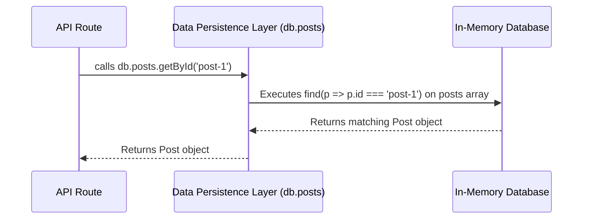
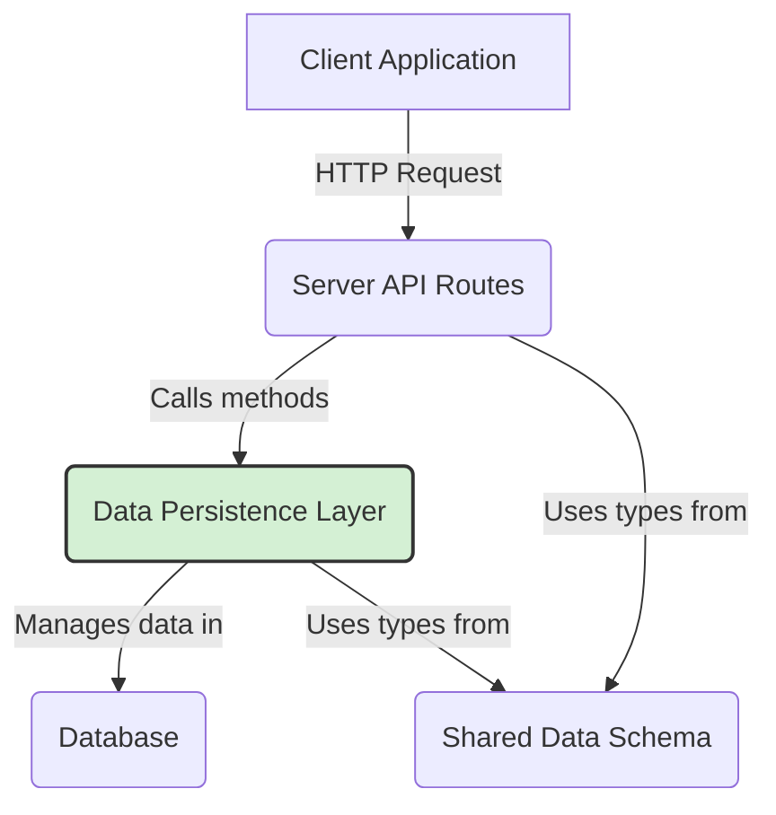

# Chapter 4: Data Persistence Layer

Having established a library of [Reusable UI Component System](chapter_03.md) components, we have the building blocks for our user interface. However, these components are static without data. To bring our application to life, we need a way to store, retrieve, and manage the information that these components will display. This chapter introduces the Data Persistence Layer, the server-side foundation responsible for handling all application data.

---

### Problem & Motivation

Imagine building a blog application. A user writes a new post, hits "Publish," and sees it on the screen. But what happens if the server restarts or the user closes their browser and comes back later? If the data only exists in the server's memory, the post is lost forever. This is the core problem that a persistence layer solves: it provides a reliable, long-term storage solution for application data.

Without a dedicated persistence layer, our API routes would need to contain raw database queries. This would tightly couple our application logic to a specific database technology (like PostgreSQL or MongoDB), making it difficult to maintain, test, or ever switch databases. If we needed to change how we fetch posts, we would have to hunt down and modify every single API route that performs that action.

This chapter details our approach to creating a clean, abstracted Data Persistence Layer. Our guiding use case will be managing blog posts: we need to be able to **create** a new post, **read** a list of all posts, **read** a single post by its ID, and eventually **update** or **delete** it. This layer will act as the single, authoritative source for all data-related operations, ensuring our application is robust, scalable, and easy to manage.

### Core Concept Explanation

The **Data Persistence Layer** is a crucial part of our server's architecture that acts as a bridge between our application's logic and the physical database. Its primary job is to abstract away the complexities of database interaction. Instead of writing raw SQL queries or database-specific commands directly in our API routes, we interact with a clean, simple set of functions.

Think of this layer as a skilled librarian in a massive library. Our API route (the library patron) doesn't need to know the complex cataloging system or the exact shelf where a book is located. The patron simply asks the librarian, "Can you get me the book 'Moby Dick'?" The librarian (our persistence layer) knows exactly how to find it, retrieve it, and hand it back. This separation of concerns makes the patron's job (handling the request) much simpler.

In our project, this layer is implemented as a collection of "repositories." A **repository** is a design pattern that centralizes all the logic for a specific type of data. For instance, a `PostsRepository` will contain all the functions needed to manage blog posts (`getAll`, `getById`, `create`, etc.), while a `UsersRepository` would handle user data.

Crucially, this layer is built upon our [Shared Data Schema](chapter_01.md). Every function within our repositories will use the TypeScript types defined in the shared schema, such as `Post`. This guarantees that the data we save to the database and the data we retrieve from it always conform to the expected shape, preventing bugs and ensuring type safety across the entire server.

---

### Practical Usage Examples

Let's see how our API logic can use the Data Persistence Layer to perform basic CRUD (Create, Read, Update, Delete) operations for our blog posts. We'll interact with a central `db` object, which exposes our repositories.

#### Initializing the Database Client

First, any file that needs to interact with the database will import our pre-configured client. This object is the single entry point to all our data repositories.

```typescript
// src/server/api/routes/posts.ts
import { db } from '../../db';

// Now we can use db.posts to access post-related functions.
```
*This simple import gives us access to the entire data layer, including the `posts` repository and any others we might add later.*

#### Reading All Posts

To fetch a list of all blog posts, we call the `getAll` method from our `posts` repository.

```typescript
// src/server/api/routes/posts.ts
const allPosts = db.posts.getAll();

console.log(allPosts);
```
*This single line abstracts away the entire database query. The method returns an array of `Post` objects, guaranteed by TypeScript to match our shared schema.*

**Expected Output:**
```json
[
  { "id": "post-1", "title": "First Post", "content": "..." },
  { "id": "post-2", "title": "Second Post", "content": "..." }
]
```

#### Reading a Single Post by ID

To retrieve one specific post, we use the `getById` method, passing the unique identifier for the post we want.

```typescript
// src/server/api/routes/posts.ts
const specificPost = db.posts.getById('post-1');

console.log(specificPost);
```
*This function will search the database for a post with the matching `id`. If found, it returns the `Post` object; otherwise, it returns `undefined`.*

**Expected Output:**
```json
{ "id": "post-1", "title": "First Post", "content": "Hello world!" }
```

#### Creating a New Post

To add a new post to our database, we call the `create` method. We only need to provide the data for the new post; the persistence layer will handle assigning a unique ID and storing it.

```typescript
// src/server/api/routes/posts.ts
const newPostData = {
  title: 'A Brand New Post',
  content: 'This is the content of our new post.',
};
const createdPost = db.posts.create(newPostData);

console.log(createdPost);
```
*The `create` method takes an object with the post's title and content, persists it, and returns the complete `Post` object, including its newly generated `id`.*

**Expected Output:**
```json
{
  "id": "post-3",
  "title": "A Brand New Post",
  "content": "This is the content of our new post."
}
```

---

### Internal Implementation Walkthrough

While using the persistence layer is simple, it's helpful to understand how it works internally. For this project, we're using a simple in-memory JSON object as our "database" to keep things easy to run, but the structure is designed to be easily swappable with a real database like PostgreSQL or SQLite.

**File Location:** The core logic resides in `src/server/db/`.

1.  **The Database Seed (`_data.ts`):** We start with some initial data. This file simply exports an array of post objects that act as our starting dataset.

    ```typescript
    // src/server/db/_data.ts
    import { Post } from '../../shared/types';

    export const initialPosts: Post[] = [
      { id: 'post-1', title: 'First Post', content: 'Hello world!' },
      { id: 'post-2', title: 'Second Post', content: 'Another one!' },
    ];
    ```
    *This file defines the initial state of our database, using the `Post` type from our [Shared Data Schema](chapter_01.md) for type safety.*

2.  **The `PostsRepository` (`posts.ts`):** This is where the logic for managing posts lives. It imports the initial data and defines functions to interact with it.

    ```typescript
    // src/server/db/posts.ts
    import { Post } from '../../shared/types';
    import { initialPosts } from './_data';

    // In-memory "table" for posts
    const posts: Post[] = [...initialPosts];

    export const postsRepository = {
      getAll: () => posts,
      getById: (id: string) => posts.find((p) => p.id === id),
      // ... other methods like create, update, delete
    };
    ```
    *This file creates an encapsulated module for post-related database operations. Notice how `getById` uses a simple JavaScript `find` method. If we were using SQL, this is where the `SELECT * FROM posts WHERE id = ?` query would live.*

3.  **The Main DB Export (`index.ts`):** This file assembles all the different repositories into a single `db` object that the rest of our application can import.

    ```typescript
    // src/server/db/index.ts
    import { postsRepository } from './posts';

    export const db = {
      posts: postsRepository,
      // users: usersRepository, // We could add more here
    };
    ```
    *This acts as the main entry point to our persistence layer, making it easy to access different data repositories from a single, consistent import.*

The flow of a request is illustrated below:



---

### System Integration

The Data Persistence Layer is a foundational server-side component that primarily serves one consumer: the **Server API Routes**. It sits between the HTTP-handling logic and the raw data source.



The data flow is as follows:
1.  A request from the client hits a specific endpoint defined in the `[Server API Routes](chapter_05.md)`.
2.  The API route handler for that endpoint calls a method on the `db` object (e.g., `db.posts.getAll()`).
3.  The Data Persistence Layer executes the necessary logic to retrieve or modify data in the database.
4.  It returns data that is strongly typed according to the `[Shared Data Schema](chapter_01.md)`.
5.  The API route then packages this data and sends it back to the client as a JSON response.

This clean separation ensures that our API routes are lean and focused on their main responsibility: handling HTTP requests and responses. All the messy details of data management are neatly tucked away in the persistence layer.

### Best Practices & Tips

-   **Keep Repositories Focused:** Each repository should only be responsible for one type of data. Avoid creating a single, massive "god object" that handles posts, users, and comments all at once.
-   **Abstract, Don't Leak:** The methods in your repository should be generic. For example, use `getById` instead of `getPostByMongoId`. This allows you to change the underlying database without having to refactor all the API routes that use it.
-   **Handle "Not Found" Cases Gracefully:** When querying for a single item (e.g., `getById`), it's common for nothing to be found. Your repository method should return `null` or `undefined` in this case. It is the responsibility of the *API route* to translate that into a `404 Not Found` HTTP status code.
-   **Input Validation:** While our simple example doesn't show it, a real-world persistence layer should validate incoming data before saving it. For a `create` method, ensure the `title` and `content` are not empty before attempting to insert them into the database.

---

### Chapter Conclusion

In this chapter, we have constructed a clean, type-safe, and maintainable Data Persistence Layer. By abstracting database operations into focused repositories, we have decoupled our application logic from our data storage mechanism. This layer provides a stable foundation for managing all our application's data, ensuring consistency and reliability through its integration with our shared TypeScript schema.

With a solid way to manage our data, we are now ready to expose this data to the outside world. The next step is to build the HTTP endpoints that will use this persistence layer to respond to requests from our client-side application.

**Next:** We will build the web server endpoints in [Chapter 5: Server API Routes](chapter_05.md).