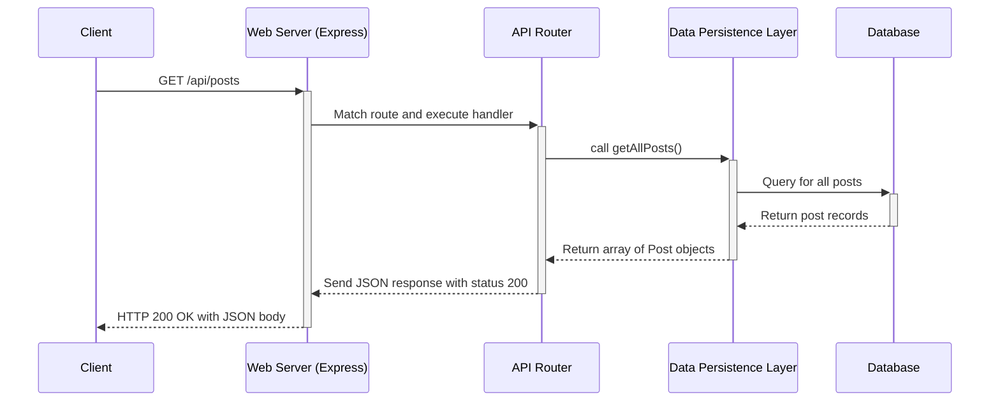

# Chapter 5: Server API Routes

With a robust [Data Persistence Layer](chapter_04.md) in place, our server now has the ability to communicate with the database. However, this functionality is currently locked away within the server itself. To be useful, we need to expose these data operations to the outside world—specifically, to our client-side React application. This chapter details how we build the bridge between the client and server: the API routes.

---

### Problem & Motivation

Our project is a full-stack application with a clear separation between the frontend (the user interface) and the backend (the server and database). The client runs in the user's browser, and the server runs on a remote machine. They are two distinct programs that cannot directly access each other's memory or functions. How, then, does the client ask the server to fetch a list of posts or save a new one?

This separation creates a communication gap. We need a standardized, secure, and well-defined way for the client to send requests to the server and for the server to send responses back. Without a formal set of "doorways" or endpoints, the communication would be chaotic and insecure, with no clear rules about who can access what data and how.

Imagine our application needs to display a list of all blog posts on its homepage. The client-side code needs to say, "Hey server, please give me all the posts you have." The server needs to understand this request, retrieve the posts using the data layer, and send them back in a format the client can understand. Server API routes are the mechanism that makes this structured conversation possible.

### Core Concept Explanation

**Server API Routes** (or endpoints) are specific URLs on our server that are programmed to listen for incoming network requests from a client. Think of them like a restaurant's menu. The menu lists specific items you can order (e.g., "Get all posts," "Create a new post"). The client "places an order" by sending a request to a specific URL, and the server "kitchen" (our business logic and data layer) fulfills that order and sends the result back.

This communication happens over HTTP (Hypertext Transfer Protocol), the standard protocol of the web. Each request has two key components:
1.  **A URL Path**: The address the client is contacting (e.g., `/api/posts`).
2.  **An HTTP Method (or Verb)**: The action the client wants to perform. The most common are:
    *   `GET`: Retrieve data.
    *   `POST`: Create new data.
    *   `PUT`/`PATCH`: Update existing data.
    *   `DELETE`: Remove data.

In our project, we use a routing library (like Express.js) on the server. This library acts as a traffic controller. It inspects the URL and HTTP method of every incoming request and directs it to the correct handler function. This handler function contains the logic to process the request, use the [Data Persistence Layer](chapter_04.md) to interact with the database, and finally, send a structured response (usually in JSON format) back to the client. This entire process ensures that our server's internal logic is neatly encapsulated and exposed only through a secure and predictable API.

---

### Practical Usage Examples

Let's implement the API routes needed to solve our motivating use case: fetching and creating blog posts. We will use the Express.js framework for this.

#### 1. Setting Up the Main Router

First, we need to set up our server to use a main router. In our `server/src/index.ts`, we'll define a base path for all our API endpoints, like `/api`.

```typescript
// server/src/index.ts
import express from 'express';
import postsRouter from './routes/posts.router';

const app = express();
app.use(express.json()); // Middleware to parse JSON bodies

// All routes related to posts will be under /api/posts
app.use('/api/posts', postsRouter);

app.listen(3001, () => console.log('Server running'));
```
Here, we tell our application that any request starting with `/api/posts` should be handled by the `postsRouter`.

#### 2. Creating a Route to Fetch All Posts

Next, we define the logic for fetching posts in a dedicated router file. This route will handle `GET` requests to `/api/posts`.

```typescript
// server/src/routes/posts.router.ts
import { Router } from 'express';
import { db } from '../data/persistence';
import { Post }t from '../../../shared/schemas';

const router = Router();

// Handles GET requests to /api/posts
router.get('/', (req, res) => {
  const posts: Post[] = db.getAllPosts();
  res.status(200).json(posts);
});

export default router;
```
When a client sends a `GET` request to `/api/posts`, this code runs. It calls `db.getAllPosts()` from our persistence layer and sends the result back as a JSON array with a `200 OK` status code. The `Post` type is imported directly from the [Shared Data Schema](chapter_01.md), ensuring type safety.

#### 3. Creating a Route to Add a New Post

Now, let's add a route to handle creating a new post. This will respond to `POST` requests at `/api/posts`.

```typescript
// Add this to server/src/routes/posts.router.ts

// Handles POST requests to /api/posts
router.post('/', (req, res) => {
  // The client sends the new post data in the request body
  const newPostData = req.body;
  
  const createdPost: Post = db.createPost(newPostData);
  res.status(201).json(createdPost);
});
```
This handler takes the post data from the request's body, uses `db.createPost()` to save it, and returns the newly created post with a `201 Created` status code.

---

### Internal Implementation Walkthrough

What happens behind the scenes when a client requests `GET /api/posts`? The process follows a clear, predictable sequence known as the **request-response cycle**.

1.  **Request Initiation**: The client application (e.g., a browser) creates and sends an HTTP `GET` request to the server's address, specifically to the path `/api/posts`.
2.  **Server Listener**: Our Express server is constantly listening for incoming connections. It receives the request.
3.  **Routing**: The server's routing middleware examines the request's path (`/api/posts`) and method (`GET`). It matches this signature to the handler function we defined in `posts.router.ts`.
4.  **Handler Execution**: The matched handler function `(req, res) => { ... }` is executed.
5.  **Data Layer Interaction**: Inside the handler, the code calls `db.getAllPosts()`, which is a method from our [Data Persistence Layer](chapter_04.md).
6.  **Database Query**: The persistence layer performs the necessary operation to retrieve all post records from the database.
7.  **Response Generation**: The database returns the post data to the persistence layer, which passes it back to the route handler. The handler then packages this data into a JSON format and attaches a `200` status code.
8.  **Response Transmission**: The server sends the complete HTTP response (headers, status code, and JSON body) back to the client over the network.

This entire interaction can be visualized with a sequence diagram:



---

### System Integration

API Routes are the central hub of server-side activity, connecting several other abstractions to fulfill a request.

*   **[Shared Data Schema](chapter_01.md)**: This is the most critical integration. The API routes enforce the data contract for the entire application. When receiving data in a `POST` request, the route should validate it against the shared schema. When sending data back, it *must* be structured according to the schema. This guarantees that the client and server always speak the same language.

*   **[Data Persistence Layer](chapter_04.md)**: The API routes are the primary *consumers* of the Data Persistence Layer. Routes should **never** contain raw database queries. Instead, they delegate all data operations to the persistence layer's well-defined functions (e.g., `getAllPosts`, `createPost`). This separation of concerns makes the code cleaner, easier to test, and more secure.

*   **[Client-Side Data Fetching Client](chapter_06.md)** (Upcoming): These API routes are the *target* for the client. The data-fetching client we will build in the next chapter is specifically designed to make HTTP requests to the URLs we've defined here. The routes form the server-side half of the communication channel, while the data-fetching client will form the client-side half.

### Best Practices & Tips

*   **Use RESTful Conventions**: Structure your API around resources (like "posts" or "users"). Use plural nouns for your endpoints (e.g., `/posts` instead of `/getPosts`) and use HTTP verbs to indicate the action.
*   **Statelessness**: Each request from a client should contain all the information needed to understand and process it. Avoid storing request-specific state on the server.
*   **Proper HTTP Status Codes**: Use appropriate status codes to signal the outcome of a request.
    *   `200 OK`: Success for `GET` requests.
    *   `201 Created`: Success for a `POST` that created a resource.
    *   `400 Bad Request`: The client sent invalid data.
    *   `404 Not Found`: The requested resource does not exist.
    *   `500 Internal Server Error`: An unexpected error occurred on the server.
*   **Implement Error Handling**: Your route handlers should be wrapped in `try...catch` blocks or use an error-handling middleware to gracefully manage unexpected errors and prevent the server from crashing.
*   **Validate Incoming Data**: Never trust data coming from a client. Before using `req.body` in a `POST` or `PUT` request, validate its structure and types to ensure it conforms to your [Shared Data Schema](chapter_01.md).

### Chapter Conclusion

In this chapter, we constructed the vital communication bridge between our client and server. The Server API Routes act as a well-defined, secure, and organized "front door" to our server's capabilities. By handling incoming HTTP requests and orchestrating interactions with the data layer, these routes expose our application's data to the frontend in a controlled manner.

We have now successfully built a server that can listen for requests and respond with data. The final piece of the puzzle is to enable our client-side React application to initiate these requests, receive the data, and display it to the user.

With our server's API ready and waiting, we can now turn our attention to the frontend and build the other side of the communication channel. We will do this by creating a dedicated [Client-Side Data Fetching Client](chapter_06.md).