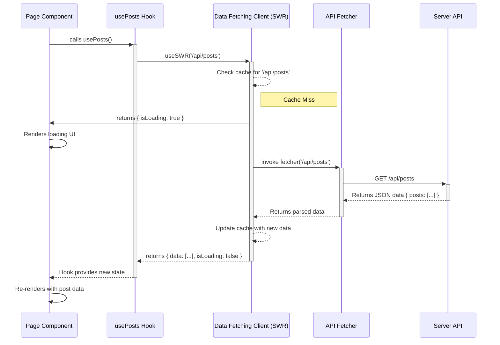

# Chapter 6: Client-Side Data Fetching Client

In the [Server API Routes](chapter_05.md) chapter, we established a clear set of endpoints for the client to communicate with the server. Now, we need a robust, intelligent, and efficient way for our React frontend to consume these endpoints. This chapter introduces the **Client-Side Data Fetching Client**, the bridge that connects our UI to the server's data.

---

### Problem & Motivation

Imagine building a simple page to display a list of blog posts. Without a dedicated data-fetching strategy, a component would need to handle everything itself: trigger the network request, store the incoming data in a state variable, manage a "loading" state to show a spinner, and catch any network errors to display a message. This process would have to be repeated in every component that needs data, leading to a lot of boilerplate code, potential inconsistencies, and inefficient network usage as different components might request the same data multiple times.

The core problem is that raw data fetching adds significant complexity directly into our UI components. This makes them harder to read, test, and maintain. Furthermore, it often results in a poor user experience with unnecessary loading screens and no intelligent caching. Our goal is to abstract this complexity away, allowing our components to simply *ask for data* and react to its state (loading, available, or error) without worrying about the underlying mechanics.

For instance, if a user navigates from the homepage (showing all posts) to a specific post page and then back, they shouldn't have to wait for the same list of posts to load again. A smart data-fetching client can cache this data and display it instantly, creating a much faster and smoother experience. This abstraction provides that intelligence.

### Core Concept Explanation

The **Client-Side Data Fetching Client** is a dedicated layer in our frontend application responsible for managing the entire lifecycle of remote data. Think of it as an intelligent data librarian for our app. Instead of a component going directly to the "server shelf" to get a book (data), it makes a request to the librarian.

The librarian (our data client) handles everything:
1.  **Requesting:** It knows how to go to the server and fetch the data correctly.
2.  **Caching:** If you ask for the same book you just returned, the librarian might keep it at the front desk (in a cache) and give it to you instantly without going back to the shelves. This makes subsequent data requests incredibly fast.
3.  **State Management:** The librarian keeps you informed about the status of your request. It will tell you if it's "on its way to the shelf" (`loading`), if it has "found the book" (`success`), or if it "couldn't find it" (`error`).
4.  **Revalidation:** The librarian is also smart enough to know when a book might be outdated. It might give you the cached version immediately but go check the shelf in the background to see if a newer edition is available. This popular pattern is called **stale-while-revalidate**.

By centralizing these concerns, our components become much simpler. They only need to use a hook provided by the client to request data. This hook returns the data itself, along with the current loading and error status, abstracting away all the complex state management and network logic.

---

### Practical Usage Examples

Let's apply this concept to our motivating use case: fetching a list of blog posts. We'll use a custom hook, `usePosts`, which is our application's interface to the data-fetching client.

#### 1. Defining the Fetcher Function

First, we need a simple function that tells our client *how* to fetch the data. This function will use the browser's native `fetch` API to call our server endpoint.

```typescript
// src/lib/apiClient.ts

// This generic fetcher can be used by any query.
export const fetcher = async (url: string) => {
  const res = await fetch(url);
  if (!res.ok) throw new Error("An error occurred.");
  return res.json();
};
```
This function takes a URL, fetches the data, and handles basic error checking. It will be the core mechanism our client uses to talk to the [Server API Routes](chapter_05.md).

#### 2. Creating a Custom Data Hook

Next, we create a dedicated hook for fetching posts. This encapsulates the logic for this specific data type, making it reusable across the application.

```typescript
// src/hooks/usePosts.ts
import useSWR from 'swr'; // The underlying library
import { fetcher } from '../lib/apiClient';
import { Post } from '../shared/schema';

export function usePosts() {
  const { data, error, isLoading } = useSWR<Post[]>(
    '/api/posts',
    fetcher
  );
  return { posts: data, error, isLoading };
}
```
Here, `useSWR` is the core hook from our underlying library. We provide it with a unique **key** (`'/api/posts'`) to identify this data in the cache and our `fetcher` function. The hook returns the `data`, `error`, and `isLoading` state.

#### 3. Consuming the Hook in a Component

Finally, a page component can use this hook to get the data and render the UI. The component's logic is now clean, declarative, and focused solely on presentation.

```tsx
// src/components/pages/PostsPage.tsx
import { usePosts } from '../../hooks/usePosts';

function PostsPage() {
  const { posts, error, isLoading } = usePosts();

  if (isLoading) return <div>Loading posts...</div>;
  if (error) return <div>Failed to load posts.</div>;

  return (
    <ul>
      {posts?.map(post => <li key={post.id}>{post.title}</li>)}
    </ul>
  );
}
```
This component is incredibly simple. It doesn't know *how* the data is fetched or cached; it just knows its state. This separation of concerns is the primary benefit of our data-fetching client.

---

### Internal Implementation Walkthrough

While our project uses an external library like `SWR` or `TanStack Query` for the heavy lifting, we've built a structured layer on top of it. Let's see how a request flows through our system.

1.  **The Provider:** At the root of our application, we wrap everything in a provider from the underlying library (e.g., `SWRConfig`). This provider manages the global cache and configuration.

    ```tsx
    // src/pages/_app.tsx
    import { SWRConfig } from 'swr';
    import { fetcher } from '../lib/apiClient';
    
    function MyApp({ Component, pageProps }) {
      return (
        <SWRConfig value={{ fetcher }}>
          <Component {...pageProps} />
        </SWRConfig>
      );
    }
    ```
    By providing a global `fetcher`, we don't have to pass it into every `useSWR` call.

2.  **The Hook Call:** When `PostsPage` mounts, it calls `usePosts()`.

3.  **Cache Lookup:** The `useSWR` hook inside `usePosts` first checks its internal cache using the key `'/api/posts'`.
    *   **Cache Hit:** If valid (non-stale) data exists for this key, it is returned immediately. The UI renders instantly.
    *   **Cache Miss:** If no data exists, `isLoading` is set to `true`, and the component re-renders to show the "Loading..." message.

4.  **Data Fetching:** For a cache miss, the client invokes our `fetcher` function with the key `'/api/posts'` as the URL. The fetcher makes an HTTP `GET` request to the server.

5.  **State Updates:**
    *   **On Success:** The server responds with JSON data. The fetcher parses it, and the client updates its cache. `isLoading` becomes `false`, the `data` variable is populated, and the component re-renders to display the list of posts.
    *   **On Failure:** If `fetch` fails or the response is not `ok`, the fetcher throws an error. The client catches it, sets the `error` state, and the component re-renders to show the error message.

This entire flow is visualized below.



---

### System Integration

The Data Fetching Client is a central hub in our frontend architecture, connecting several other key abstractions.

*   **[Shared Data Schema](chapter_01.md):** The client is fully type-aware. The `Post` type imported from our shared schema ensures that the data returned from the `usePosts` hook matches the expected structure. This prevents runtime errors and provides excellent autocompletion during development.
*   **[Server API Routes](chapter_05.md):** The keys used by our data-fetching hooks (e.g., `'/api/posts'`) directly map to the endpoints we defined on the server. This creates a clear and predictable contract between the client and server.
*   **[Page Components](chapter_07.md):** As the primary consumers, **Page Components** are kept lean and focused on presentation. They delegate all data-fetching concerns to this client via custom hooks, leading to a clean separation of concerns.

### Best Practices & Tips

*   **Use Descriptive Keys:** The cache key is the unique identifier for your data. Always use keys that clearly represent the resource, like `/api/users/${userId}/todos`.
*   **Keep Fetchers Generic:** The `fetcher` function should be stateless and generic. Avoid putting resource-specific logic inside it.
*   **Handle All States:** Always account for the `isLoading` and `error` states in your components. A user should never be left looking at a blank screen without feedback.
*   **Colocate Hooks with Components (Initially):** While it's good to centralize hooks eventually, you can start by defining a data-fetching hook within the component that uses it. Refactor it into a shared `hooks/` directory once another component needs it.
*   **Data Mutations:** For updating data (POST, PUT, DELETE), use the `mutate` function provided by the client. This allows you to update the local cache optimistically for a snappy UI and then re-fetch the data from the server to ensure consistency.

---

### Chapter Conclusion

The Client-Side Data Fetching Client is an indispensable abstraction that brings structure, efficiency, and a superior user experience to our application. By centralizing caching, state management, and request logic, it dramatically simplifies our component code and protects our application from common pitfalls associated with network communication. It transforms data fetching from a complex, imperative task into a simple, declarative hook call.

With a solid understanding of how our client retrieves data, we are now fully equipped to build the views that will present this data to the user. In the next chapter, we will dive into creating [Page Components](chapter_07.md), which will compose our reusable UI elements and use our new data-fetching hooks to bring the application to life.