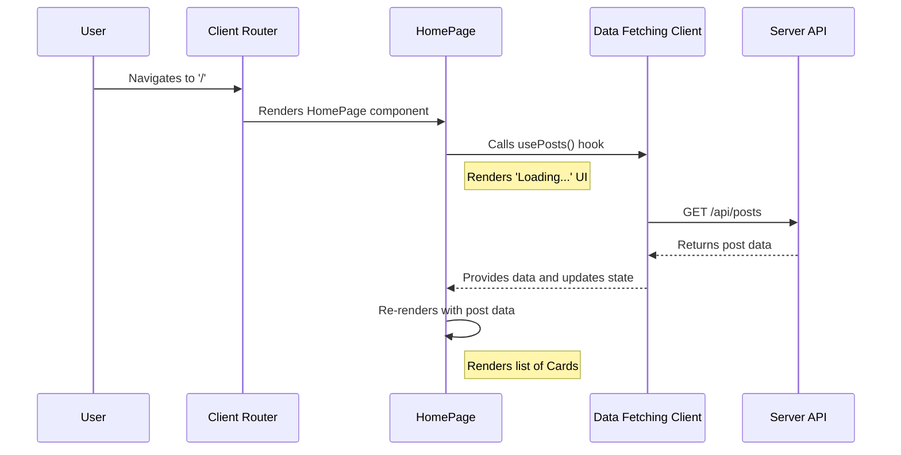

# Chapter 7: Page Components

With a robust [Client-Side Data Fetching Client](chapter_06.md) in place, we have an efficient way to request data from our server. However, this data is useless until it's presented to the user. This chapter focuses on **Page Components**, the top-level containers that orchestrate the layout, fetch the necessary data, and compose our UI into the distinct views a user can navigate to.

---

### Problem & Motivation

As an application grows, we can't display all information on a single screen. Users expect to navigate between different sections, like a home feed, a user profile, or a settings panel. This introduces a fundamental problem: how do we structure our application into distinct, navigable "views"? How do we ensure that when a user visits a specific URL, they see the correct layout populated with the correct data?

Without a clear concept of "pages," our frontend would become a chaotic jumble of components, making it impossible to manage application flow or separate concerns. A user visiting `/` should see a welcome screen with a list of posts, while visiting `/settings` should show them configuration options. Each of these views has unique data requirements and layout structures.

Page components solve this by acting as the primary entry point for a specific URL. They serve as the "master assembler" for a given view, responsible for fetching the required data and arranging smaller, [Reusable UI Components](chapter_03.md) to build the final screen that the user sees. Our motivating use case will be to build a `HomePage` that displays a list of all posts fetched from our API.

### Core Concept Explanation

A **Page Component** is a React component that represents a complete screen or a distinct route within the application. Unlike smaller UI components like `Button` or `Card` that are designed for reuse everywhere, a page component is typically used once—as the top-level component for a specific URL path (e.g., `/`, `/about`, `/posts/:id`).

The primary responsibilities of a page component are:

1.  **Layout Orchestration**: It defines the high-level structure of a view. It doesn't concern itself with the inner workings of a button or a modal, but rather with arranging them on the screen. It might render a `Header`, a `Sidebar`, and a main content area filled with `Card` components.
2.  **Data Acquisition**: It is the component that triggers the data fetching process. Using the hooks provided by our [Client-Side Data Fetching Client](chapter_06.md), the page component requests the specific data it needs to render its view.
3.  **State Management**: It manages the state associated with the data fetching lifecycle for that view. This includes showing a "loading" spinner while data is being fetched, displaying an error message if the request fails, or rendering a "no results" message for an empty data set.

Think of a page component as the director of a play. The director doesn't build the props (`Reusable UI Components`) or write the script (`Shared Data Schema`), but they are responsible for placing the actors on stage, telling them when to speak, and ensuring the entire scene comes together to tell a cohesive story for the audience (the user).

---

### Practical Usage Examples

Let's build our `HomePage` to demonstrate how page components work. This page will fetch a list of posts from our API and display them using a `Card` component.

#### Step 1: Create the Page Component File

First, we create a new file for our page. By convention, pages are often stored in a `src/pages` or `src/views` directory.

```tsx
// src/pages/HomePage.tsx
import React from 'react';

export const HomePage = () => {
  return (
    <main>
      <h1>All Posts</h1>
      {/* Post list will go here */}
    </main>
  );
};
```
This is the basic skeleton of our page. It's a standard React component that renders a main heading.

#### Step 2: Integrate the Data Fetching Hook

Next, we use the `usePosts` hook from our [Client-Side Data Fetching Client](chapter_06.md) to request the list of posts.

```tsx
// src/pages/HomePage.tsx
import { usePosts } from '../hooks/usePosts'; // From Chapter 6

export const HomePage = () => {
  const { data: posts, isLoading, error } = usePosts();

  // ... rest of the component
};
```
This hook gives us the `posts` data, along with boolean flags `isLoading` and `error` to manage the UI state.

#### Step 3: Handle Loading and Error States

A good user experience requires feedback. We'll show a message to the user while the data is loading or if an error occurs.

```tsx
// src/pages/HomePage.tsx
// ... inside the HomePage component
if (isLoading) {
  return <p>Loading posts...</p>;
}

if (error) {
  return <p>Could not load posts. Please try again later.</p>;
}
```
This ensures the user is never looking at a blank or broken screen. The component will return early with these status messages.

#### Step 4: Render the Data with Reusable Components

Once the data is successfully loaded, we map over the `posts` array and render each item using a `Card` component from our [Reusable UI Component System](chapter_03.md).

```tsx
// src/pages/HomePage.tsx
import { Card } from '../components/ui/Card'; // From Chapter 3

// ... after loading and error checks
return (
  <main>
    <h1>All Posts</h1>
    {posts?.map((post) => (
      <Card key={post.id} title={post.title} />
    ))}
  </main>
);
```
Here, the `HomePage` is orchestrating the UI. It doesn't know how a `Card` is styled; it only knows it needs to render one `Card` for each post in the data array. This is a perfect example of separation of concerns.

### Internal Implementation Walkthrough

While a page component is just a React component, its role in the application's lifecycle is critical. Let's trace the flow from a user's action to a fully rendered page.

1.  **Navigation**: The user enters the root URL (`/`) into their browser.
2.  **Routing**: The application's router (which we will build in [Client Application Root](chapter_08.md)) matches the `/` path to the `HomePage` component.
3.  **Component Mount**: React mounts the `HomePage` component into the DOM. The initial render occurs.
4.  **Data Fetching Triggered**: During the initial render, the `usePosts()` hook is executed. This hook, from our fetching client, initiates an API call to the server's `/api/posts` endpoint.
5.  **Loading State UI**: The `isLoading` flag from the hook is `true`, so the component returns the `<p>Loading posts...</p>` JSX. The user sees this message immediately.
6.  **Data Arrival & State Update**: The server responds with the post data. The data fetching client receives this data, updates its internal cache, and sets `isLoading` to `false`. This state change triggers a re-render of the `HomePage` component.
7.  **Final Render**: The component re-renders. This time, `isLoading` is false and `posts` contains the array of post data. The component proceeds to map over the array and render the list of `Card` components.

This entire sequence can be visualized as follows:



### System Integration

Page components are the central hub where many of our other abstractions meet and interact.

-   **[Reusable UI Component System](chapter_03.md)**: Page components are the primary *consumers* of our UI library. They compose components like `Card`, `Layout`, and `Header` to build complete views.
-   **[Client-Side Data Fetching Client](chapter_06.md)**: Pages use the hooks provided by the fetching client to acquire the data they need. They are responsible for triggering fetches and handling the resulting states (loading, success, error).
-   **[Shared Data Schema](chapter_01.md)**: The data that flows into a page component (e.g., `posts`) is strictly typed according to our shared schema. This provides type safety and autocompletion, ensuring the page passes the correct props to child components.
-   **[Client Application Root](chapter_08.md)**: The application root is the direct parent of all page components. It contains the routing logic that decides *which* page component to render based on the current URL.

---

### Best Practices & Tips

-   **Keep Pages Lean**: Page components should focus on layout and data orchestration. Any complex UI logic, state, or behavior should be extracted into smaller, reusable components or custom hooks. A page component's code should be easy to read and primarily describe *what* is on the page, not *how* each piece works.
-   **Handle All States**: Always account for loading, error, and empty-data states. A robust page provides a clear and informative UI for every possible state of the data fetching lifecycle.
-   **Separate Data and Presentation**: Use the container/presentational pattern where appropriate. The page acts as a "container" that fetches data, while delegating the rendering of that data to smaller "presentational" components.
-   **Colocate Pages with Routes**: The structure of your `src/pages` directory should ideally mirror the route structure of your application. For example, a settings page at `/dashboard/settings` might live at `src/pages/dashboard/settings.tsx`.

### Chapter Conclusion

Page components are the essential building blocks that transform our application from a collection of components into a structured, navigable user experience. They bridge the gap between data fetching and UI rendering, acting as the orchestrator for everything a user sees on a specific screen. By keeping them focused on this role, we maintain a clean and scalable frontend architecture.

We now have all the pieces needed to build individual views. The final step is to create the main entry point for our entire client-side application, which will manage global providers, routing, and tie all our pages together.

Next, we will explore the **[Client Application Root](chapter_08.md)**.