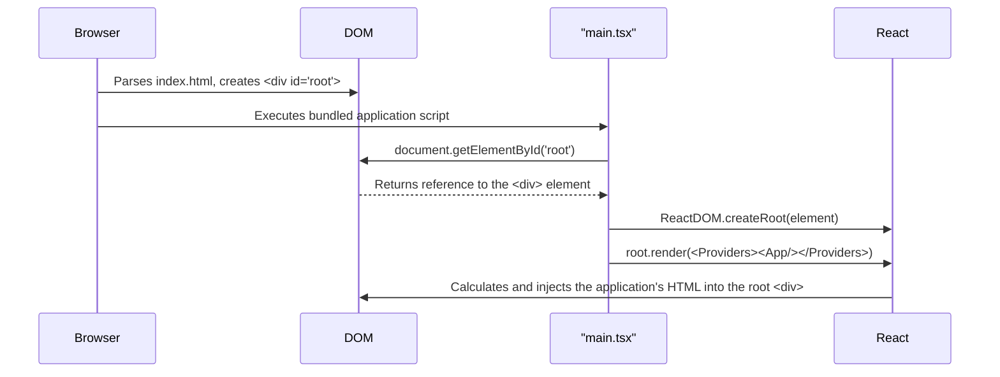

# Chapter 8: Client Application Root

With our [Page Components](chapter_07.md) now defined, we have all the individual views of our application ready to go. However, a collection of pages is not yet a functional application. We need a way to assemble them, provide them with global services like theming and data fetching, and finally render the result into the user's browser. This final chapter covers the crucial entry point that brings everything together: the Client Application Root.

---

### Problem & Motivation

When a user navigates to our application's URL, their browser receives a simple HTML file. This file contains a basic document structure but is otherwise empty. It's a blank canvas. The browser itself has no innate understanding of React, components, or our application's logic. The fundamental problem is: **how do we bridge the gap between a static HTML file and our dynamic, component-based React application?**

Without a designated entry point, our carefully crafted components and pages would remain as inert code, never to be seen or interacted with. We need a specific mechanism to "inject" our application into the browser's page, set up the foundational context (like themes and data-fetching capabilities), and establish the routing system that displays the correct page based on the URL.

Imagine building a complex electrical system with lights, switches, and appliances. You can have all the individual parts perfectly assembled, but without connecting the entire system to the main power source, nothing will turn on. The Client Application Root is that main power source. It finds the "socket" in the HTML document and energizes the entire application, allowing data to flow and components to light up the screen.

### Core Concept Explanation

The Client Application Root is the TypeScript/JavaScript file that serves as the initial starting point for our entire frontend application. Its primary responsibility is to find a specific element in the HTML file and instruct React to take control of it, rendering our component tree inside. This process is often called "mounting" or "hydrating" the application.

At its core, this concept relies on a few key ideas:

1.  **The HTML Host:** Our single-page application lives within a minimal `index.html` file. This file contains a specific placeholder element, typically `<div id="root"></div>`. This `div` is the designated container where our entire React application will reside. It's the "stage" upon which our component-based play will be performed.

2.  **The React DOM Library:** React is split into two main libraries: `react`, which defines how to create components and manage state, and `react-dom`, which knows how to take those components and render them into a web browser's DOM (Document Object Model). The application root uses `react-dom` to make this connection.

3.  **Creating the Root:** The process begins by using a function from `react-dom/client`, specifically `ReactDOM.createRoot()`. This function takes the HTML placeholder element as an argument and creates a React-managed "root" instance. This tells React, "You are now in control of this part of the HTML document."

4.  **Global Providers:** Before rendering our main application component, we wrap it in a series of "Providers." These are special components that use React's Context API to make data or functionality available to the entire component tree nested within them. For our project, this includes the `ThemeProvider` for styling and the `QueryClientProvider` for data fetching. This ensures that any component, no matter how deeply nested, can access the theme or make API requests without needing to have this functionality passed down manually through props.

---

### Practical Usage Examples

Let's walk through setting up the application root to solve our motivating use case: rendering our application for a user who has just landed on the homepage.

#### Step 1: The HTML Target

First, we need the placeholder in our public HTML file. This file is the very first thing the user's browser loads.

```html
<!-- public/index.html -->
<!DOCTYPE html>
<html lang="en">
  <body>
    <noscript>You need to enable JavaScript to run this app.</noscript>
    <div id="root"></div>
    <!-- Our React app will be injected here -->
  </body>
</html>
```
**Explanation:** This is a standard HTML file. The key element is `<div id="root"></div>`. Our entire application will be rendered inside this `div` by our script.

#### Step 2: The TypeScript Entry Point

Next, we create the `main.tsx` file, which finds the root element and tells React to render our primary `App` component into it.

```typescript
// src/main.tsx
import React from 'react';
import ReactDOM from 'react-dom/client';
import App from './App';

const rootElement = document.getElementById('root')!;
const root = ReactDOM.createRoot(rootElement);

root.render(<App />);
```
**Explanation:**
- We import the necessary libraries (`react`, `react-dom/client`) and our main `App` component.
- `document.getElementById('root')` finds the HTML `div` from the previous step.
- `ReactDOM.createRoot()` prepares this `div` to be managed by React.
- `root.render()` kicks off the rendering process, placing the `<App />` component into the DOM.

#### Step 3: Integrating Global Providers

Finally, we wrap our `App` component with the providers it needs to function correctly. We also add `React.StrictMode`, a tool that helps identify potential problems in an application.

```typescript
// src/main.tsx (Final Version)
import React from 'react';
import ReactDOM from 'react-dom/client';
import { ThemeProvider } from './theme';
import { QueryClientProvider, queryClient } from './lib/api';
import App from './App';

const rootElement = document.getElementById('root')!;
const root = ReactDOM.createRoot(rootElement);

root.render(
  <React.StrictMode>
    <QueryClientProvider client={queryClient}>
      <ThemeProvider>
        <App />
      </ThemeProvider>
    </QueryClientProvider>
  </React.StrictMode>
);
```
**Explanation:** By nesting `<App />` inside `ThemeProvider` and `QueryClientProvider`, we ensure that every component within `App` has access to the theming system and the data-fetching client.

---

### Internal Implementation Walkthrough

When a user visits our site, a precise sequence of events unfolds to bring our application to life.

1.  **Request and Response:** The user's browser requests the root URL of our site. The server responds with the `public/index.html` file.
2.  **HTML Parsing:** The browser parses the HTML. It constructs the initial DOM, which includes the empty `<div id="root"></div>`. It also discovers a `<script>` tag that points to our compiled and bundled JavaScript code.
3.  **Script Execution:** The browser downloads and executes this JavaScript bundle. The very first code to run is from our `src/main.tsx` file.
4.  **DOM Selection:** The line `document.getElementById('root')` executes, and the browser's JavaScript engine finds our empty `div` in the DOM and returns a reference to it.
5.  **React Root Creation:** `ReactDOM.createRoot()` is called with the `div` reference. React now establishes a link between its internal Virtual DOM and this specific piece of the actual browser DOM.
6.  **Component Rendering:** The `root.render()` method is called. React takes the JSX tree we provided (starting with `<React.StrictMode>`), calculates the corresponding HTML structure, and then efficiently updates the browser's DOM inside `<div id="root">` to match. From this point on, React is in full control of this part of the page.

This entire boot-up process can be visualized as follows:



### System Integration

The Client Application Root is the central point of integration for all global, client-side systems. It doesn't contain business logic itself but acts as the conductor that orchestrates the initial setup.

-   **[Application Theming](chapter_02.md):** The `<ThemeProvider>` is initialized here at the very top of the component tree. This ensures that every single component, from a simple button in the [Reusable UI Component System](chapter_03.md) to a complex view in [Page Components](chapter_07.md), can access the current theme (e.g., light or dark mode) via React context.

-   **[Client-Side Data Fetching Client](chapter_06.md):** The `<QueryClientProvider>` is also instantiated here, wrapping the entire application. This provides a global cache for our API data. Any component that needs to fetch data can now use the hooks provided by our data-fetching library, confident that the underlying client and cache have already been set up.

-   **[Page Components](chapter_07.md):** The `<App />` component, which is the direct child of our providers, is typically responsible for setting up the application's router. The router, in turn, is responsible for dynamically rendering the correct **Page Component** based on the current URL path. In this way, the root enables the entire navigation structure of the application.


*Diagram showing the root rendering providers which in turn render the App, Router, and finally the active Page Component.*

---

### Best Practices & Tips

-   **Keep It Lean:** The root file (`main.tsx` or `index.tsx`) should do one thing: initialize the application. Avoid placing any application logic, state management, or UI elements here. Its sole purpose is to mount the `App` component with its necessary global providers.

-   **Provider Order Can Matter:** While our `ThemeProvider` and `QueryClientProvider` are independent, in more complex applications, the order of providers can be critical. A general rule is to place providers that don't depend on others higher up (further outside) in the tree.

-   **Always Use `React.StrictMode`:** During development, `StrictMode` is an invaluable tool. It doesn't render any visible UI, but it activates additional checks and warnings for its descendants, helping you catch common bugs like deprecated API usage or unexpected side effects in render functions.

-   **Consider an Error Boundary:** For production applications, wrapping your app in a global "Error Boundary" component at this root level is a great practice. An Error Boundary is a special React component that can catch JavaScript errors anywhere in its child component tree, log those errors, and display a fallback UI instead of crashing the entire application.

### Chapter Conclusion

The Client Application Root is the humble yet indispensable foundation of our entire frontend. It acts as the critical bridge, connecting the static world of an HTML document to the dynamic, interactive world of our React application. By finding its target in the DOM, setting up essential global providers for theming and data, and rendering our main `App` component, it breathes life into our code.

With this final chapter, we have completed our journey through the architecture of the `learning` project. We have seen how a [Shared Data Schema](chapter_01.md) ensures type safety across the stack, how a server persists data and exposes it via an API, and how a client application fetches that data and renders it into a cohesive, themed, and navigable user interface. You now have a comprehensive understanding of every major abstraction in this full-stack application.