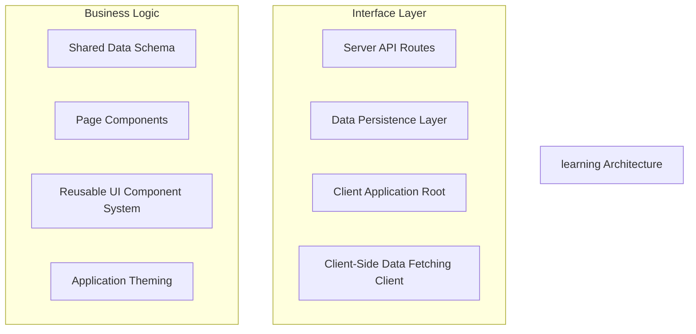
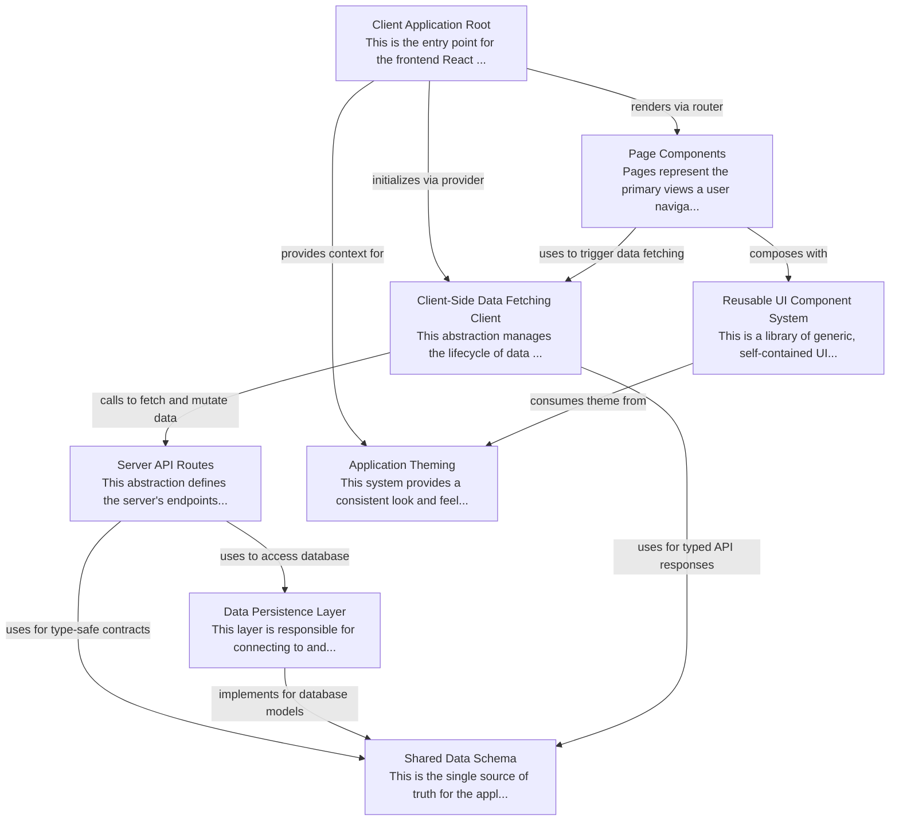

# learning Tutorial

Welcome to the comprehensive tutorial for learning. This tutorial is automatically generated from the codebase to help you understand the core concepts and implementation patterns.

## Project Overview

This project is a full-stack TypeScript application featuring a clear separation between a server-side API and a client-side React frontend. The architecture is centered around a 'Shared Data Schema' that ensures type safety and consistency across the entire stack. The client uses a modern component-based structure with a dedicated data-fetching layer and a theming system to create a consistent and maintainable user interface.

## System Architecture

## Component Relationships

## Table of Contents

1. [Chapter 1: Shared Data Schema](chapter_01.md) - Comprehensive documentation for Shared Data Schema following structured methodology...
2. [Chapter 2: Application Theming](chapter_02.md) - Comprehensive documentation for Application Theming following structured methodology...
3. [Chapter 3: Reusable UI Component System](chapter_03.md) - Comprehensive documentation for Reusable UI Component System following structured methodology...
4. [Chapter 4: Data Persistence Layer](chapter_04.md) - Comprehensive documentation for Data Persistence Layer following structured methodology...
5. [Chapter 5: Server API Routes](chapter_05.md) - Comprehensive documentation for Server API Routes following structured methodology...
6. [Chapter 6: Client-Side Data Fetching Client](chapter_06.md) - Comprehensive documentation for Client-Side Data Fetching Client following structured methodology...
7. [Chapter 7: Page Components](chapter_07.md) - Comprehensive documentation for Page Components following structured methodology...
8. [Chapter 8: Client Application Root](chapter_08.md) - Comprehensive documentation for Client Application Root following structured methodology...

## How to Use This Tutorial

1. **Start with Chapter 1** to understand the foundational concepts
2. **Follow the sequence** - each chapter builds upon previous concepts
3. **Practice with code examples** - every chapter includes practical examples
4. **Refer to diagrams** - use architecture diagrams for visual understanding
5. **Cross-reference concepts** - chapters link to related topics

## Tutorial Features

- **Progressive Learning**: Concepts are introduced in logical order
- **Code Examples**: Every chapter includes practical, executable code
- **Visual Diagrams**: Mermaid diagrams illustrate complex relationships
- **Cross-References**: Easy navigation between related concepts
- **Beginner-Friendly**: Written for newcomers to the codebase

## Contributing

This tutorial is auto-generated from the codebase. To improve it:
1. Update the source code documentation
2. Add more detailed comments to key functions
3. Regenerate the tutorial using the documentation system

---

*Generated using AI-powered codebase analysis*
