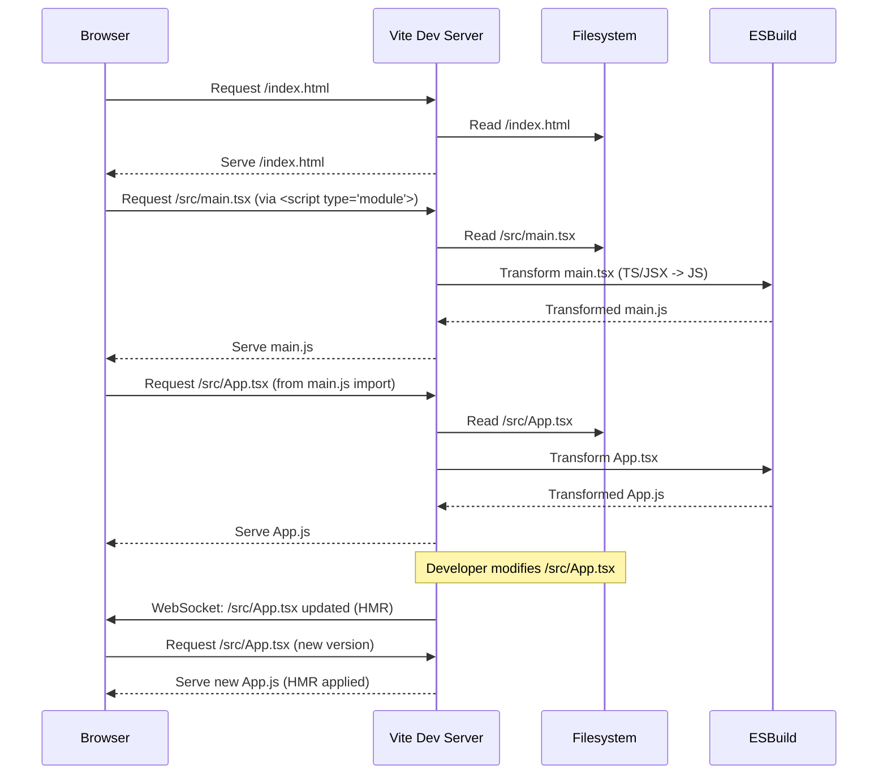

# Chapter 1: Build and Development Tooling (Vite)

Welcome to the first chapter of our "learning" project documentation! In this section, we lay the groundwork by exploring Vite, the modern build and development tool that powers our application. This chapter is designed to introduce you to Vite's core concepts, demonstrate its practical usage, and explain how it integrates seamlessly into our full-stack architecture.

---

### Problem & Motivation

Modern web applications, especially those built with frameworks like React, require sophisticated tooling to transform source code (like JSX and TypeScript) into browser-executable JavaScript, CSS, and HTML. Traditionally, this process involved complex bundlers like Webpack, which often led to slow development server startup times and intricate configuration files. As projects grew, developers frequently faced frustrating delays waiting for code changes to reflect in the browser, hindering productivity and the overall development experience.

For our "learning" project, which aims for rapid iteration and a smooth development workflow, such bottlenecks are unacceptable. We need a tool that can provide an instant development server, near-instantaneous hot module replacement (HMR), and an optimized production build out-of-the-box. Without such a tool, the joy of building interactive learning features would quickly be overshadowed by the struggle against slow development cycles.

Consider the common scenario where a developer is tweaking the styling or logic of a React component for a learning activity. With traditional tools, each small change might trigger a full rebuild taking several seconds, forcing the developer to lose focus. Our project demands a solution that allows for real-time feedback, enabling developers to see their changes instantly, fostering a highly productive and enjoyable development environment. This is precisely the problem Vite is engineered to solve.

---

### Core Concept Explanation

Vite (French for "fast," pronounced `/vit/`) is a next-generation frontend tooling that focuses on delivering an extremely fast development experience. Unlike traditional bundlers that bundle your entire application before serving it, Vite leverages native ES Modules (ESM) directly in the browser during development. This paradigm shift eliminates the bundling step during development server startup, leading to near-instant server boot times.

During development, when the browser requests a module, Vite transforms and serves it on demand, ensuring that only the necessary code is processed. This "no-bundle" development approach, combined with highly efficient Hot Module Replacement (HMR), means that when you make a change to a component, only that specific module and its immediate dependencies are updated, resulting in lightning-fast updates without a full page reload.

For production builds, Vite gracefully falls back to a battle-tested bundler, Rollup, to optimize and bundle your application for deployment. This two-pronged approach gives developers the best of both worlds: blazing-fast development for productivity and highly optimized, production-ready code for deployment. Key terms to remember are: **Native ES Modules (ESM)** for efficient development serving, **Hot Module Replacement (HMR)** for instant feedback, and **Rollup** for optimized production bundling.

---

### Practical Usage Examples

Let's see how Vite helps us get started and manage our "learning" project's frontend development.

#### Initializing a Vite Project

To start a new project with Vite, we use the `npm create vite` command, specifying the project name and desired framework (React, in our case).

```bash
npm create vite@latest learning-frontend --template react-ts
```
*This command initializes a new Vite project named `learning-frontend` using the React with TypeScript template. It sets up all the basic files and configurations required to start developing a React application.*

#### Running the Development Server

Once the project is set up, navigate into the project directory and install dependencies, then you can start the development server.

```bash
cd learning-frontend
npm install
npm run dev
```
*The `npm run dev` command fires up Vite's development server. It will typically open your browser to `http://localhost:5173` (or another available port) and serve your application with HMR enabled, providing instant feedback on code changes.*

#### Building for Production

When you're ready to deploy your application, Vite compiles and optimizes it using Rollup.

```bash
npm run build
```
*This command triggers Vite to bundle your entire application into a production-ready static asset bundle, usually placed in a `dist/` directory. This output is highly optimized for performance and smaller file sizes.*

#### Previewing the Production Build

After building, you can use Vite's built-in preview server to test the production build locally.

```bash
npm run preview
```
*The `npm run preview` command serves the static files from the `dist/` directory, mimicking how a production server would serve your application. This is useful for verifying that your optimized build works as expected before deployment.*

---

### Internal Implementation Walkthrough

Vite's magic lies in its dual-mode operation: a highly optimized development server and a robust production build system.

#### Development Server Mechanism

During development, Vite leverages the browser's native support for ES Modules (`import`/`export` statements). When you start the dev server, Vite doesn't bundle your entire application. Instead, it acts as a smart module server.

1.  **Browser Request**: Your browser requests the root HTML file (`index.html`).
2.  **Module Graph**: The `index.html` might contain a script tag like `<script type="module" src="/src/main.tsx"></script>`. The browser then requests `/src/main.tsx`.
3.  **On-Demand Transformation**: Vite intercepts this request. If `main.tsx` contains TypeScript or JSX, Vite quickly transforms it into standard JavaScript using ESBuild (a very fast bundler written in Go) and serves it back to the browser. It doesn't perform full bundling.
4.  **Dependency Resolution**: If `main.tsx` imports `App.tsx`, the browser will then request `/src/App.tsx`. Vite repeats the transformation process for `App.tsx` and any of its dependencies, building a module graph on demand.
5.  **Hot Module Replacement (HMR)**: When you modify `App.tsx`, Vite detects the change. Instead of reloading the entire page, it uses a WebSocket connection to inform the browser which specific module has changed. The browser then requests only the updated `App.tsx` module, and the HMR runtime patches the running application code, preserving application state.

Here's a simplified sequence diagram illustrating the development server flow:


*This diagram shows how the browser and Vite's development server interact. Vite processes modules one by one, only when requested, and uses ESBuild for fast transformations, leading to extremely quick server startup and HMR.*

#### Production Build Process

For production, Vite switches to Rollup, a highly configurable and efficient JavaScript bundler.

1.  **Entry Point Scan**: Vite provides Rollup with the `index.html` as the entry point.
2.  **Dependency Graph Creation**: Rollup traverses all imported modules, building a complete dependency graph of your entire application.
3.  **Optimizations**: It then applies various optimizations:
    *   **Tree-shaking**: Removes unused code.
    *   **Code Splitting**: Divides your application into smaller chunks that can be loaded on demand.
    *   **Minification**: Reduces file sizes by removing whitespace and shortening variable names.
    *   **Asset Handling**: Processes CSS, images, and other assets.
4.  **Output Generation**: Finally, Rollup generates optimized JavaScript, CSS, and HTML files into the `dist/` directory, ready for deployment.

---

### System Integration

Vite plays a crucial role as the frontend build orchestrator in our "learning" project, sitting squarely between our React application code and the web browser.

#### Serving the React Frontend

Vite is primarily responsible for taking our React source code (TypeScript, JSX, CSS modules, etc.) and making it runnable in the browser. During development, it provides the fast HMR experience, allowing us to quickly iterate on UI components and application pages. For production, it bundles these assets into a deployable package.

The `index.html` file acts as the entry point for our single-page application (SPA), containing a `<div id="root"></div>` where our React app will mount and a script tag that points to our main React entry file:

```html
<!-- public/index.html (simplified) -->
<!DOCTYPE html>
<html lang="en">
  <head>
    <meta charset="UTF-8" />
    <link rel="icon" type="image/svg+xml" href="/vite.svg" />
    <meta name="viewport" content="width=device-width, initial-scale=1.0" />
    <title>Learning App</title>
  </head>
  <body>
    <div id="root"></div>
    <script type="module" src="/src/main.tsx"></script>
  </body>
</html>
```
*This `index.html` is the foundation. The `<script type="module" src="/src/main.tsx"></script>` line tells the browser to load our main TypeScript React component, which Vite then serves and transforms.*

#### Connecting to the Backend API

Since our "learning" project follows a client-server architecture, the frontend needs to communicate with the backend API. During development, the frontend runs on a different port (e.g., `http://localhost:5173`) than the backend API (e.g., `http://localhost:3000`). To avoid Cross-Origin Resource Sharing (CORS) issues, Vite provides a powerful proxy feature.

We configure Vite to forward specific API requests from the frontend to the backend server. This is typically done in `vite.config.ts` (or `vite.config.js`).

```typescript
// vite.config.ts
import { defineConfig } from 'vite';
import react from '@vitejs/plugin-react';

export default defineConfig({
  plugins: [react()],
  server: {
    proxy: {
      '/api': { // Any requests starting with /api
        target: 'http://localhost:3000', // Forward to our backend server
        changeOrigin: true, // Needed for virtual hosted sites
        rewrite: (path) => path.replace(/^\/api/, ''), // Remove /api prefix
      },
    },
  },
});
```
*This `vite.config.ts` snippet sets up a proxy. When the React frontend makes a request like `/api/users`, Vite's development server intercepts it, rewrites it to `/users`, and forwards it to `http://localhost:3000`. This allows the frontend to interact with the backend seamlessly during development, making it appear as if they are on the same origin.*

This integration ensures that our frontend, developed with Vite, can effectively fetch and send data to our backend, which will be discussed in detail in the [Client-Server Architecture](chapter_02.md) chapter.

---

### Best Practices & Tips

To make the most of Vite in your "learning" project, consider these best practices:

*   **Utilize Vite Plugins**: Vite's plugin system is powerful. Use official plugins like `@vitejs/plugin-react` for framework support, and explore community plugins for things like SVG loading, image optimization, or specific component libraries.
*   **Environment Variables**: Manage different settings (e.g., API URLs) for development and production using Vite's environment variable support. Prefix your variables with `VITE_` to make them accessible in your frontend code.
    ```javascript
    // In .env.development
    VITE_API_URL=http://localhost:3000/api

    // In React component
    console.log(import.meta.env.VITE_API_URL);
    ```
    *This demonstrates how to define an environment variable for your API URL and access it within your frontend code, ensuring flexibility between environments.*
*   **Configure Aliases**: For cleaner import paths, especially in larger projects, configure path aliases in `vite.config.ts`.
    ```typescript
    // vite.config.ts
    import { defineConfig } from 'vite';
    import react from '@vitejs/plugin-react';
    import path from 'path';

    export default defineConfig({
      plugins: [react()],
      resolve: {
        alias: {
          '@': path.resolve(__dirname, './src'),
          '@components': path.resolve(__dirname, './src/components'),
        },
      },
    });
    ```
    *This configuration allows you to replace lengthy relative imports like `../../components/Button` with cleaner absolute imports like `@components/Button`.*
*   **Optimize Production Builds**: While Vite's default build is good, you can further optimize by reviewing the bundle analyzer output (if you install a plugin for it) and ensuring large libraries are dynamically imported where possible.
*   **Troubleshooting Common Issues**:
    *   **Port Conflicts**: If `npm run dev` fails due to a port conflict, Vite usually suggests an alternative. You can also manually specify a port in `vite.config.ts`: `server: { port: 8080 }`.
    *   **Build Failures**: Check the console output carefully. Often, TypeScript errors, linting issues, or incorrect plugin configurations are the culprits.
    *   **CORS Issues (during development)**: Ensure your `proxy` configuration in `vite.config.ts` is correctly set up for your backend API endpoints.

---

### Chapter Conclusion

In this foundational chapter, we've explored Vite, the cutting-edge build and development tool that significantly enhances our "learning" project's development workflow. We've understood its "no-bundle" development approach, leveraged its swift HMR capabilities, and seen how it efficiently optimizes our code for production. From its quick setup to its seamless integration with our backend via proxy configurations, Vite is indispensable for creating a responsive and enjoyable development experience.

Having established how our frontend code is built and served, we're now ready to delve into the larger architectural context. The next chapter will provide a comprehensive overview of our project's overall structure, detailing how the frontend and backend communicate and collaborate to deliver a complete learning application.

[Client-Server Architecture](chapter_02.md)