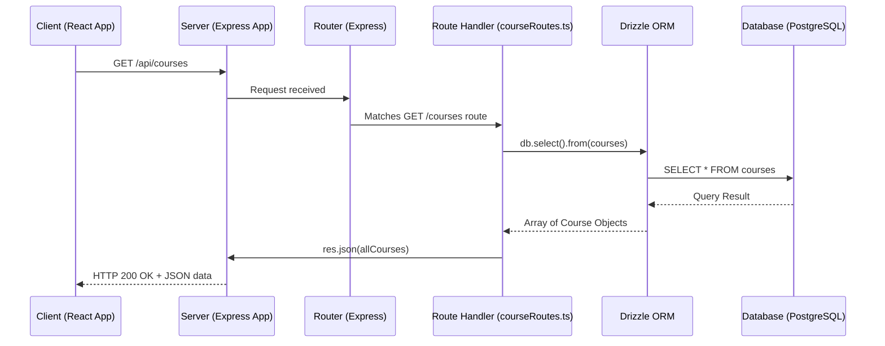

# Chapter 6: Server API and Routing

Welcome back! In our [previous chapter on Shared Data Schema and Database](chapter_05.md), we established how our application's data is structured and consistently defined, and how the server interacts with the database using Drizzle ORM. Now that our data has a home and a guardian, the crucial next step is to make this data accessible and modifiable by our frontend client. This is where the Server API and Routing come into play.

---

### Problem & Motivation

Imagine our frontend React application, full of beautifully designed [reusable UI components](chapter_03.md) arranged into [distinct application pages](chapter_04.md). It needs to display a list of courses, allow users to enroll, or create new learning materials. How does it get this information from the server, or send new information to be saved? Without a defined communication mechanism, the client and server would be like two people speaking different languages – unable to understand each other.

This is the fundamental problem that server API and routing solve. They provide a structured "language" and a set of "doorways" for the client to interact with the backend's data and logic. Without these, our full-stack "learning" application would remain two isolated parts, unable to fulfill its purpose of delivering dynamic, data-driven learning experiences. For instance, to display all available courses, the frontend needs to "ask" the backend for them, and the backend needs to know *how* to respond to that specific request.

---

### Core Concept Explanation

At its heart, a **Server API (Application Programming Interface)** defines a set of rules and protocols for how software components should communicate with each other. In a web application context, it specifies how our client-side code can interact with our backend server. Think of it as a menu in a restaurant: it lists all the dishes (data/actions) you can order (request) and what ingredients (parameters) you might need to specify, and what you'll receive in return (response).

**Routing** is the mechanism within the server that directs incoming client requests to the appropriate pieces of backend code. When the client sends a request (e.g., to `/api/courses` with an HTTP GET method), the server's router inspects the incoming URL and the HTTP method, then matches it to a specific function designed to handle that particular request. This function, often called a "route handler" or "controller," then executes the necessary business logic, interacts with the database, and prepares a response.

The primary ways clients interact with these API routes are through **HTTP Methods**:
*   **GET**: Used to retrieve data from the server (e.g., get all courses).
*   **POST**: Used to send new data to the server to create a new resource (e.g., create a new course).
*   **PUT/PATCH**: Used to update existing data on the server (e.g., update a course's title).
*   **DELETE**: Used to remove data from the server (e.g., delete a course).
These methods, combined with specific URL paths (called **endpoints**), form the unique addresses for different API functionalities.

---

### Practical Usage Examples

Let's illustrate how our backend defines routes to handle common requests. We'll assume a Node.js server using the popular Express.js framework for routing. Our goal is to fetch a list of courses and allow the creation of a new course.

#### 1. Defining a GET Route to Fetch All Courses

To get all courses, the frontend will make a GET request to an endpoint like `/api/courses`. The backend needs to listen for this.

```typescript
// src/server/routes/courseRoutes.ts (simplified)
import { Router } from 'express';
import { db } from '../db/index'; // Our Drizzle DB instance from Chapter 5
import { courses } from '../../shared/schema'; // Shared schema

const router = Router();

router.get('/courses', async (req, res) => {
  try {
    const allCourses = await db.select().from(courses);
    res.json(allCourses);
  } catch (error) {
    console.error('Failed to fetch courses:', error);
    res.status(500).json({ error: 'Failed to retrieve courses' });
  }
});

export default router;
```
*Explanation*: This code snippet defines a `GET` route for `/courses`. When a client requests this endpoint, the route handler `async (req, res) => { ... }` is executed. Inside, it uses `db.select().from(courses)` (powered by Drizzle ORM from [Shared Data Schema and Database](chapter_05.md)) to fetch all entries from our `courses` table and sends them back as JSON.

#### 2. Defining a POST Route to Create a New Course

To allow the frontend to create a new course, we'll define a `POST` route.

```typescript
// src/server/routes/courseRoutes.ts (continued)
import { Router } from 'express';
import { db } from '../db/index';
import { courses } from '../../shared/schema';

// ... (previous GET route) ...

router.post('/courses', async (req, res) => {
  const { title, description } = req.body; // Expecting title and description in request body
  if (!title || !description) {
    return res.status(400).json({ error: 'Title and description are required' });
  }
  try {
    const newCourse = await db.insert(courses).values({ title, description }).returning();
    res.status(201).json(newCourse[0]); // Return the newly created course
  } catch (error) {
    console.error('Failed to create course:', error);
    res.status(500).json({ error: 'Failed to create course' });
  }
});

export default router;
```
*Explanation*: This `POST` route to `/courses` expects `title` and `description` in the request body. It performs basic validation and then uses `db.insert(courses).values(...)` to add a new record to the database. Upon success, it returns the newly created course object with a `201 Created` status.

#### 3. Integrating Routes into the Main Server

Finally, these individual route definitions need to be 'mounted' onto the main server application.

```typescript
// src/server/index.ts
import express from 'express';
import cors from 'cors'; // For cross-origin requests
import courseRoutes from './routes/courseRoutes';

const app = express();
const PORT = process.env.PORT || 3001;

app.use(cors()); // Allow requests from our frontend
app.use(express.json()); // Enable parsing of JSON request bodies

// Mount our course routes under the /api path
app.use('/api', courseRoutes);

app.get('/', (req, res) => {
  res.send('Learning Project Backend API');
});

app.listen(PORT, () => {
  console.log(`Server running on http://localhost:${PORT}`);
});
```
*Explanation*: This `src/server/index.ts` file sets up our Express server. It applies middleware like `cors` (to allow our frontend to talk to it) and `express.json()` (to parse JSON data from requests). Crucially, `app.use('/api', courseRoutes)` tells the server that any request starting with `/api` should be handled by our `courseRoutes` module, thus making `/api/courses` the full path.

---

### Internal Implementation Walkthrough

Let's trace what happens when a client makes a `GET /api/courses` request:

1.  **Client Initiates Request**: Our React frontend (from a future [Frontend Data Management](chapter_07.md) chapter) makes an HTTP GET request to `http://localhost:3001/api/courses`.

2.  **Server Receives Request**: The Node.js server, listening on port 3001, receives this incoming HTTP request.

3.  **Middleware Processing**: The request first passes through any global middleware defined in `src/server/index.ts`:
    *   `cors()`: Checks if the request's origin is allowed.
    *   `express.json()`: If it were a POST/PUT request with a JSON body, this would parse it. For a GET, it simply passes through.

4.  **Routing Match**: The server's Express router then examines the request's method (`GET`) and path (`/api/courses`). It matches `/api` to the base path where `courseRoutes` are mounted (`app.use('/api', courseRoutes)`). Then, within `courseRoutes`, it finds the `router.get('/courses', ...)` definition.

5.  **Route Handler Execution**: The matched route handler function (`async (req, res) => { ... }` in `src/server/routes/courseRoutes.ts`) is executed.
    *   It calls `db.select().from(courses)` to query our PostgreSQL database via Drizzle ORM.
    *   Drizzle translates this into a SQL query, executes it, and returns the result as JavaScript objects based on our [shared data schema](chapter_05.md).

6.  **Response Generation**: The handler receives the `allCourses` array.
    *   `res.json(allCourses)` serializes this array into a JSON string.
    *   `res.status(200)` (default for `res.json`) sets the HTTP status code to indicate success.
    *   The server sends this HTTP response back to the client.

Here's a sequence diagram illustrating this flow:



---

### System Integration

The Server API and Routing layer acts as the critical bridge in our [Client-Server Architecture](chapter_02.md).
*   **Connecting with Data**: It directly leverages the capabilities established in [Shared Data Schema and Database](chapter_05.md). Our route handlers use the `db` instance and `courses` schema defined there to interact with the database, ensuring data consistency and type safety. Any change to the shared schema would directly impact what our API can accept or return.
*   **Serving the Frontend**: These APIs are the primary data source for our frontend. The client-side application will make HTTP requests to these defined endpoints to fetch, create, update, and delete data. This interaction will be thoroughly explored in the [Frontend Data Management](chapter_07.md) chapter, where we'll use tools like React Query to consume these APIs efficiently.
*   **Backend Logic**: Beyond just database interactions, route handlers also encapsulate our core business logic. This might include validation, authentication checks, sending notifications, or orchestrating complex operations that involve multiple database tables or external services.

---

### Best Practices & Tips

*   **RESTful Principles**: Design your API endpoints to be RESTful where appropriate. This means using nouns for resources (`/api/courses`), pluralizing them, and using standard HTTP methods (GET, POST, PUT, DELETE) to define actions on those resources. This makes your API intuitive and predictable.
*   **Input Validation**: Always validate input received from the client. As shown in our `POST /api/courses` example, checking for required fields prevents malformed data from reaching your database and causing errors. Use libraries like Zod (which pairs well with Drizzle) for robust schema-based validation.
*   **Error Handling**: Implement comprehensive error handling. Catch potential errors during database operations or other logic, log them appropriately on the server, and return meaningful (but not overly revealing) error messages and appropriate HTTP status codes (e.g., 400 Bad Request, 401 Unauthorized, 404 Not Found, 500 Internal Server Error) to the client.
*   **Security**: Be mindful of security. Validate and sanitize all user input to prevent SQL injection or cross-site scripting (XSS) attacks. Implement authentication and authorization mechanisms to ensure only permitted users can access certain endpoints or perform specific actions.
*   **API Versioning**: For larger applications, consider versioning your API (e.g., `/api/v1/courses`, `/api/v2/courses`). This allows you to make breaking changes without immediately impacting existing clients.
*   **Clear Documentation**: As you're reading now, clear documentation of your API endpoints, expected request formats, and response structures is crucial for both frontend developers and anyone else interacting with your backend.

---

### Chapter Conclusion

In this chapter, we've demystified how our backend server exposes its capabilities to the client through a well-defined API and robust routing mechanisms. We've seen how specific HTTP requests are mapped to server-side logic, allowing our frontend to fetch a list of courses or create new ones. This forms the essential communication backbone of our [client-server architecture](chapter_02.md), bringing our [shared data schema and database](chapter_05.md) to life for the users. Understanding server API and routing is fundamental to building any interactive web application.

With our server now capable of serving and receiving data, the next logical step is to see how our frontend client consumes these APIs to manage its own data state and update the user interface. We'll dive into this crucial aspect in the next chapter.

[Frontend Data Management](chapter_07.md)