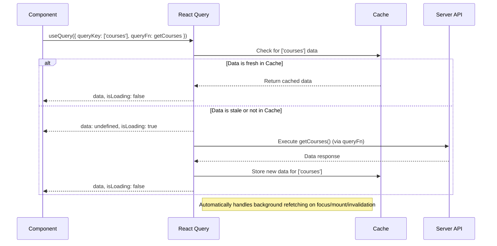

# Chapter 7: Frontend Data Management

In the previous chapter, [Server API and Routing](chapter_06.md), we explored how our backend exposes robust API endpoints to serve and receive data. We learned how the server defines routes and handles requests, making data available for consumption. This chapter shifts our focus to the client-side, demonstrating how our React frontend efficiently interacts with these APIs to fetch, cache, and update data, providing a seamless and responsive user experience.

---

### Problem & Motivation

Developing modern web applications often involves extensive interaction with backend APIs. Without a structured approach, managing data fetching in a React application can quickly become complex and error-ridden. Consider the following common challenges:

1.  **Manual Loading & Error States:** Each data request typically requires managing `isLoading`, `isError`, and `data` states. Duplicating this logic across many components leads to boilerplate and potential inconsistencies.
2.  **Stale Data & Caching:** Data fetched once might become outdated if the backend changes. Manually implementing caching to prevent excessive network requests, while also ensuring data freshness, is a non-trivial task.
3.  **Refetching Logic:** When a component re-mounts, or the user refocuses the browser window, data often needs to be refetched. Managing these lifecycle events and intelligent refetching strategies can be cumbersome.
4.  **Race Conditions:** Multiple concurrent requests for the same data can lead to unpredictable UI states if not properly managed.
5.  **Complex Operations:** Implementing features like pagination, infinite scrolling, or optimistic updates manually adds significant complexity.

In our "learning" project, which deals with dynamic content like courses, lessons, and user progress, these problems are particularly acute. We need a reliable and performant way to display lists of courses, update user scores, or add new content without burdening developers with repetitive data management tasks. For instance, imagine a page displaying a list of courses. Without efficient data management, every navigation back to this page might trigger a full reload, leading to slow load times and a poor user experience.

---

### Core Concept Explanation

To address these challenges, our project utilizes **React Query** (now officially TanStack Query) for frontend data management. React Query is a powerful library that acts as a "server-state manager" for your React applications. Unlike traditional client-state managers (like Redux or Zustand) that focus on global application state, React Query specializes in managing asynchronous data fetching, caching, synchronization, and updates with your backend.

At its heart, React Query provides a set of hooks that abstract away the complexities of interacting with APIs. It treats server data as a separate concern from client UI state, allowing it to apply intelligent optimizations. Key concepts include:

*   **`QueryClient`**: The central instance that manages all your queries and their cache. It provides the methods for interacting with the cache, such as invalidating queries or prefetching data.
*   **`QueryClientProvider`**: A React Context provider that makes the `QueryClient` instance available to all components within its tree.
*   **`useQuery`**: The primary hook for fetching and subscribing to data. You provide it with a unique `queryKey` and a `queryFn` (an asynchronous function that fetches data). It automatically handles loading, error, and success states, and intelligently caches the fetched data.
*   **`useMutation`**: The hook for performing asynchronous data modifications (e.g., POST, PUT, DELETE requests). It gives you control over the mutation's lifecycle, including `onSuccess`, `onError`, and `onSettled` callbacks, which are crucial for invalidating related queries and updating the UI.

By leveraging these concepts, React Query enables us to declaratively fetch data, letting the library handle the intricacies of caching, background refetching, and state synchronization, significantly improving both developer experience and application performance.

---

### Practical Usage Examples

Let's illustrate how React Query solves our motivating use case: fetching and displaying a list of learning courses, and then adding a new course.

First, we need to set up the `QueryClient` and wrap our application with `QueryClientProvider` so that all components can access React Query's functionality. This is typically done in your application's entry file (e.g., `src/main.tsx`).

```tsx
// src/main.tsx
import React from 'react';
import ReactDOM from 'react-dom/client';
import App from './App.tsx';
import './index.css';
import { QueryClient, QueryClientProvider } from '@tanstack/react-query';

// Create a client
const queryClient = new QueryClient();

ReactDOM.createRoot(document.getElementById('root')!).render(
  <React.StrictMode>
    <QueryClientProvider client={queryClient}>
      <App />
    </QueryClientProvider>
  </React.StrictMode>,
);
```

This setup initializes `queryClient` which will manage our cache and provide it to the entire application via the `QueryClientProvider`.

#### Fetching Data with `useQuery`

Now, let's create a component to fetch and display our courses. We'll assume an `api.ts` file exists with functions to interact with our [Server API and Routing](chapter_06.md).

```tsx
// src/api.ts (Example API calls)
import type { Course } from './shared/types'; // Using types from Shared Data Schema

export async function getCourses(): Promise<Course[]> {
  const response = await fetch('/api/courses'); // Calls backend API
  if (!response.ok) throw new Error('Failed to fetch courses');
  return response.json();
}

export async function addCourse(newCourse: Omit<Course, 'id'>): Promise<Course> {
  const response = await fetch('/api/courses', {
    method: 'POST',
    headers: { 'Content-Type': 'application/json' },
    body: JSON.stringify(newCourse),
  });
  if (!response.ok) throw new Error('Failed to add course');
  return response.json();
}
```

Now, the `CourseList` component:

```tsx
// src/components/CourseList.tsx
import { useQuery } from '@tanstack/react-query';
import { getCourses } from '../api';

interface Course {
  id: string;
  title: string;
  description: string;
}

function CourseList() {
  const { data, isLoading, error } = useQuery<Course[]>({
    queryKey: ['courses'], // Unique key for this query
    queryFn: getCourses, // Function to fetch the data
  });

  if (isLoading) return <p>Loading courses...</p>; // Display while fetching
  if (error) return <p>Error loading courses: {error.message}</p>; // Display on error

  return (
    <div>
      <h2>Available Courses</h2>
      <ul>
        {data?.map((course) => (
          <li key={course.id}>
            <strong>{course.title}</strong>: {course.description}
          </li>
        ))}
      </ul>
    </div>
  );
}

export default CourseList;
```

In this example:
*   `useQuery` is called with a `queryKey` (`['courses']`) which is a unique identifier for this particular data.
*   The `queryFn` is our `getCourses` API function, which performs the actual `fetch` request.
*   `isLoading`, `error`, and `data` are destructured from the `useQuery` result, providing immediate access to the query's state.
*   The UI updates automatically as the data state changes, showing loading, error, or the actual course list.

#### Updating Data with `useMutation`

Next, let's create a component to add a new course. When a new course is added, we want our `CourseList` to automatically reflect the change without a manual page refresh.

```tsx
// src/components/AddCourseForm.tsx
import React, { useState } from 'react';
import { useMutation, useQueryClient } from '@tanstack/react-query';
import { addCourse } from '../api';

function AddCourseForm() {
  const queryClient = useQueryClient(); // Access the QueryClient
  const [title, setTitle] = useState('');
  const [description, setDescription] = useState('');

  const mutation = useMutation({
    mutationFn: addCourse, // Function to send new course to server
    onSuccess: () => {
      // Invalidate the 'courses' query to trigger a refetch
      queryClient.invalidateQueries({ queryKey: ['courses'] });
      setTitle(''); // Clear form
      setDescription('');
    },
    onError: (error) => {
      console.error('Error adding course:', error);
      alert('Failed to add course!');
    },
  });

  const handleSubmit = (event: React.FormEvent) => {
    event.preventDefault();
    mutation.mutate({ title, description }); // Call mutation to add course
  };

  return (
    <form onSubmit={handleSubmit}>
      <h3>Add New Course</h3>
      <input
        type="text"
        placeholder="Course Title"
        value={title}
        onChange={(e) => setTitle(e.target.value)}
        required
      />
      <input
        type="text"
        placeholder="Course Description"
        value={description}
        onChange={(e) => setDescription(e.target.value)}
        required
      />
      <button type="submit" disabled={mutation.isLoading}>
        {mutation.isLoading ? 'Adding...' : 'Add Course'}
      </button>
      {mutation.isError && <p style={{ color: 'red' }}>Error: {mutation.error?.message}</p>}
    </form>
  );
}

export default AddCourseForm;
```

Here:
*   `useMutation` is used for the `addCourse` API call.
*   The `onSuccess` callback is critical: `queryClient.invalidateQueries({ queryKey: ['courses'] })` tells React Query that the data associated with the `['courses']` key might be stale. This triggers a background refetch of our `CourseList` component, ensuring the UI reflects the newly added course.
*   `mutation.isLoading` and `mutation.isError` allow us to provide immediate feedback to the user during the add operation.

---

### Internal Implementation Walkthrough

Understanding how React Query works internally helps in leveraging it effectively.

When you call `useQuery` in a component:

1.  **Query Key Registration**: React Query receives your `queryKey` (e.g., `['courses']`). This key is crucial as it uniquely identifies the data in React Query's cache.
2.  **Cache Check**: It first checks its internal cache for data associated with that `queryKey`.
    *   If fresh data exists in the cache, it's returned immediately, and `isLoading` is set to `false`. This provides instant UI rendering.
    *   If no data is in the cache, or the cached data is marked as "stale" (default behavior after a few minutes), React Query proceeds to fetch.
3.  **Data Fetching**: The `queryFn` (e.g., `getCourses`) is executed.
    *   During this period, `isLoading` is `true`.
    *   If the `queryFn` resolves successfully, the `data` state is updated, `isLoading` becomes `false`, and the new data is stored in the cache.
    *   If the `queryFn` throws an error, the `error` state is updated, and `isLoading` becomes `false`.
4.  **Automatic Refetching**: React Query intelligently refetches data in the background under several conditions:
    *   When the component mounts.
    *   When the browser window is refocused.
    *   When the network connection is re-established.
    *   When `invalidateQueries` is explicitly called (as seen in `useMutation`).
    *   At configured `staleTime` and `gcTime` intervals.

For `useMutation`:

1.  **Mutation Trigger**: When you call `mutation.mutate(variables)`, React Query executes the `mutationFn` with the provided variables.
2.  **Status Updates**: `mutation.isLoading` is set to `true` during the process.
3.  **Callback Execution**: Upon completion (success or error), the `onSuccess`, `onError`, or `onSettled` callbacks are invoked.
4.  **Cache Invalidation**: The common pattern in `onSuccess` is to call `queryClient.invalidateQueries`. This does not immediately refetch the data but rather marks the specified queries as "stale" in the cache. Any component using a stale query will then trigger a background refetch to get the latest data, ensuring UI consistency.

Here's a simplified sequence diagram for `useQuery` to visualize the flow:



---

### System Integration

Frontend Data Management, powered by React Query, is a crucial layer that connects our UI with the backend infrastructure:

*   **Connects to [Server API and Routing](chapter_06.md)**: The `queryFn` and `mutationFn` functions directly call the API endpoints exposed by our backend. The structure and expected responses from these functions are dictated by the server's API design.
*   **Enforces [Shared Data Schema and Database](chapter_05.md)**: The data fetched and manipulated by React Query adheres strictly to the `shared-schema`. This ensures type safety throughout the application, from the database (via Drizzle ORM) to the backend API, and finally to the React frontend components.
*   **Feeds [Reusable UI Components](chapter_03.md)**: Once data is fetched and managed by React Query, it's passed to our UI components (e.g., `CourseList`, `CourseCard`, `UserProgressDisplay`). These components then render the data in a consistent and structured manner.
*   **Powers [Application Pages and Navigation](chapter_04.md)**: Each distinct page (e.g., a "Courses" page, a "Lesson Detail" page) will utilize `useQuery` or `useMutation` to manage the specific data required for that view. React Query's caching ensures that navigating between pages that display similar data is fast and efficient. For example, navigating from a course list to a course detail page might already have the course data in cache, reducing load times.

In essence, React Query acts as the intelligent mediator between the user interface and the server, ensuring that data flows efficiently, is always fresh, and updates seamlessly across the application.

---

### Best Practices & Tips

To maximize the benefits of React Query and maintain a robust application:

*   **Descriptive Query Keys**: Use clear and structured `queryKey` arrays. For instance, `['courses']` for a list, `['courses', courseId]` for a specific course, or `['users', { status: 'active', page: 1 }]` for filtered/paginated data. This makes invalidation and debugging much easier.
*   **Leverage `staleTime` and `cacheTime`**:
    *   `staleTime`: How long data is considered "fresh". While fresh, `useQuery` will return cached data without refetching in the background. Default is 0 (data is always stale).
    *   `gcTime` (garbage collection time): How long unused/inactive query caches are retained in memory. Default is 5 minutes. Adjust these based on your application's needs for data freshness vs. performance.
*   **Optimistic Updates for Mutations**: For a superior user experience, consider implementing optimistic updates. This involves updating the UI immediately after a mutation is triggered, assuming it will succeed, and then rolling back the change if the mutation fails. React Query provides excellent tools for this with `onMutate` and `onError` callbacks.
*   **Error Handling**: Implement robust error boundaries and display user-friendly error messages. For mutations, use the `onError` callback to handle specific error conditions (e.g., showing a toast notification, logging the error).
*   **Use the Devtools**: TanStack Query Devtools are invaluable for understanding query states, cache contents, and debugging issues. Integrate them into your development environment.
*   **Prefetching and Preloading**: For common navigation paths, use `queryClient.prefetchQuery` or `queryClient.fetchQuery` to load data *before* the user navigates to a page. This can make transitions feel instant.
*   **`select` Option for Data Transformation**: If you only need a subset of the data returned by your `queryFn`, or if you need to transform it, use the `select` option in `useQuery` to derive new data from the query result. This prevents unnecessary re-renders in your component.

---

### Chapter Conclusion

This chapter has demonstrated the critical role of Frontend Data Management in our "learning" project, particularly through the use of React Query. We've seen how it abstracts away the complexities of data fetching, caching, and synchronization, transforming tedious boilerplate into declarative and efficient code. By effectively managing the client-side interaction with our [Server API and Routing](chapter_06.md), React Query ensures that our application is fast, responsive, and always displays up-to-date information, greatly enhancing both developer productivity and the overall user experience for our learning platform.

This concludes our comprehensive tutorial structure. We have now covered the entire stack, from modern build tooling and architecture to shared schemas, backend APIs, and efficient frontend data management.