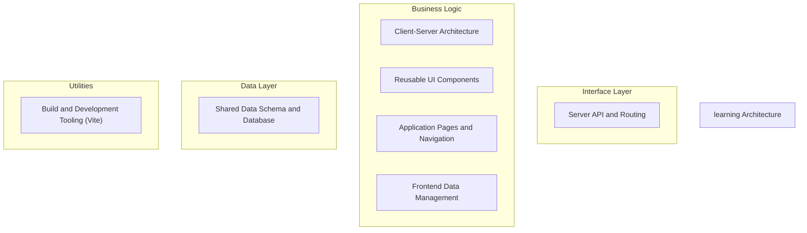
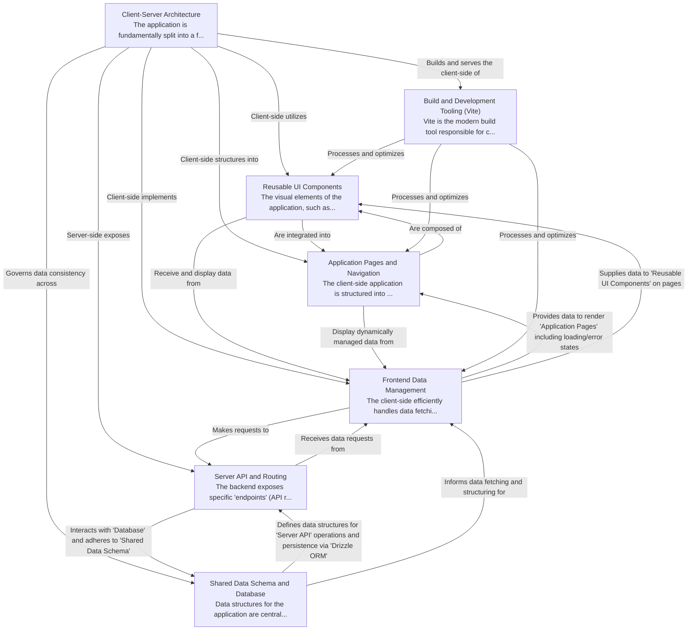

# learning Tutorial

Welcome to the comprehensive tutorial for learning. This tutorial is automatically generated from the codebase to help you understand the core concepts and implementation patterns.

## Project Overview

This project implements a full-stack web application following a client-server architecture, primarily focused on learning-related features. The frontend is built with React, leveraging reusable UI components to compose distinct application pages, while the backend provides data via a defined API. Data consistency is enforced by a shared schema and managed in a database via Drizzle ORM, with React Query efficiently handling data fetching and state on the client. Modern build tooling like Vite streamlines development and production builds.

## System Architecture

## Component Relationships

## Table of Contents

1. [Chapter 1: Build and Development Tooling (Vite)](chapter_01.md) - Comprehensive documentation for Build and Development Tooling (Vite) following structured methodolog...
2. [Chapter 2: Client-Server Architecture](chapter_02.md) - Comprehensive documentation for Client-Server Architecture following structured methodology...
3. [Chapter 3: Reusable UI Components](chapter_03.md) - Comprehensive documentation for Reusable UI Components following structured methodology...
4. [Chapter 4: Application Pages and Navigation](chapter_04.md) - Comprehensive documentation for Application Pages and Navigation following structured methodology...
5. [Chapter 5: Shared Data Schema and Database](chapter_05.md) - Comprehensive documentation for Shared Data Schema and Database following structured methodology...
6. [Chapter 6: Server API and Routing](chapter_06.md) - Comprehensive documentation for Server API and Routing following structured methodology...
7. [Chapter 7: Frontend Data Management](chapter_07.md) - Comprehensive documentation for Frontend Data Management following structured methodology...

## How to Use This Tutorial

1. **Start with Chapter 1** to understand the foundational concepts
2. **Follow the sequence** - each chapter builds upon previous concepts
3. **Practice with code examples** - every chapter includes practical examples
4. **Refer to diagrams** - use architecture diagrams for visual understanding
5. **Cross-reference concepts** - chapters link to related topics

## Tutorial Features

- **Progressive Learning**: Concepts are introduced in logical order
- **Code Examples**: Every chapter includes practical, executable code
- **Visual Diagrams**: Mermaid diagrams illustrate complex relationships
- **Cross-References**: Easy navigation between related concepts
- **Beginner-Friendly**: Written for newcomers to the codebase

## Contributing

This tutorial is auto-generated from the codebase. To improve it:
1. Update the source code documentation
2. Add more detailed comments to key functions
3. Regenerate the tutorial using the documentation system

---

*Generated using AI-powered codebase analysis*
