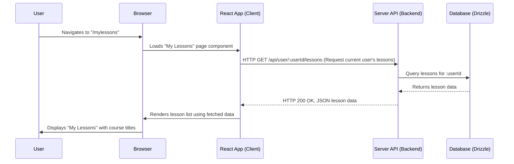

# Chapter 2: Client-Server Architecture

Welcome back! In the [previous chapter on Build and Development Tooling (Vite)](chapter_01.md), we explored how Vite streamlines our development process by quickly bundling and serving our application files. While Vite handles *how* our code is built and delivered, it doesn't define the fundamental structure of *how* different parts of our application interact. That's where the Client-Server Architecture comes into play, providing the foundational communication model for our "learning" project.

---

### Problem & Motivation

Imagine building a complex application like our "learning" platform where users can create lessons, track progress, and interact with various learning resources. If all the logic for displaying content, storing data, and managing user accounts were bundled into a single, monolithic piece of software, it would quickly become unwieldy. Such a system would be hard to scale, difficult for multiple teams to work on concurrently, and challenging to update without affecting the entire application. For instance, if we wanted to change how lessons are displayed, we might inadvertently break the database logic.

This is precisely the problem the client-server architecture solves. It provides a clear separation of concerns, allowing us to develop and maintain distinct parts of our application independently. For our "learning" project, this means the interactive user interface (like a student viewing a course) can evolve separately from the core business logic (like updating a student's completion status) and data storage (where all course materials reside). This separation is crucial for building a scalable, maintainable, and robust web application that can support a rich array of learning features.

---

### Core Concept Explanation

At its heart, the client-server architecture defines how two main components of an application—the **client** and the **server**—communicate to achieve a common goal. Think of it like a restaurant:

*   **The Client (Customer):** This is the part of the application that users directly interact with. In our web application, this is your web browser running the React frontend. It's responsible for displaying the user interface, capturing user input (e.g., clicking a "Start Lesson" button), and making requests for data or actions.
*   **The Server (Kitchen/Chef):** This is a powerful, centralized component that handles data storage, business logic, and responds to requests from various clients. For our project, this is the Node.js backend application, managing our learning resources, user profiles, and lesson progress.
*   **The Communication (Waiter/Menu):** The client and server communicate over a network, typically using the HTTP protocol (the language of the web). The client sends **requests** (like ordering from a menu), and the server processes these requests and sends back **responses** (like delivering a meal). These requests often follow a defined **API (Application Programming Interface)**, which is like the restaurant's menu, specifying what services the server offers and how to ask for them.

This setup allows our React frontend (client) to focus solely on presenting information and user interaction, while our Node.js backend (server) focuses on data persistence and core logic. They are distinct but cooperative entities, enabling modular development and easier scaling.

---

### Practical Usage Examples

Let's illustrate how our client (React app) and server (Node.js API) would communicate in a typical scenario: fetching a list of learning lessons.

First, the React client needs to *request* the lesson data from the server. This usually happens when a page loads or a user performs an action.

```javascript
// src/client/components/LessonList.jsx (Conceptual)
import React, { useEffect, useState } from 'react';

function LessonList() {
  const [lessons, setLessons] = useState([]);

  useEffect(() => {
    fetch('/api/lessons') // Make a GET request to our backend API
      .then(response => response.json())
      .then(data => setLessons(data))
      .catch(error => console.error('Error fetching lessons:', error));
  }, []);

  return (
    <div>
      <h2>Available Lessons</h2>
      {lessons.map(lesson => (
        <p key={lesson.id}>{lesson.title}</p>
      ))}
    </div>
  );
}

export default LessonList;
```
*Explanation:* This React component, `LessonList`, uses the `fetch` API to send a `GET` request to `/api/lessons`. This URL points to an endpoint on our server. Once the server responds with JSON data, the component updates its state to display the lesson titles. The `useEffect` hook ensures this fetch operation happens when the component first mounts.

On the server side, it needs to have an endpoint configured to *listen* for this specific request and provide the requested data.

```javascript
// src/server/index.ts (Conceptual)
import express from 'express';
// ... Drizzle ORM setup would be here ...

const app = express();
app.use(express.json()); // Enable JSON body parsing

// Define an API endpoint to get all lessons
app.get('/api/lessons', async (req, res) => {
  try {
    // In a real app, you'd fetch from the database via Drizzle
    const lessons = [
      { id: '1', title: 'Introduction to React' },
      { id: '2', title: 'Understanding Node.js APIs' }
    ];
    res.json(lessons); // Send the lessons data as JSON
  } catch (error) {
    console.error('Failed to retrieve lessons:', error);
    res.status(500).json({ message: 'Internal server error' });
  }
});

const PORT = process.env.PORT || 3000;
app.listen(PORT, () => {
  console.log(`Server running on port ${PORT}`);
});
```
*Explanation:* This snippet from our Express server sets up an endpoint for `GET /api/lessons`. When a client sends a request to this URL, the server executes the associated function. Here, it currently returns a hardcoded array of lessons as JSON. In a real application, this is where Drizzle ORM would be used to query our database for actual lesson data. The `res.json()` method sends the data back to the client.

This simple exchange demonstrates the core interaction: client requests, server responds.

---

### Internal Implementation Walkthrough

Let's trace a more complete journey of how a user interacts with our "learning" application using the client-server architecture.

#### Scenario: User loads the "My Lessons" page to see their enrolled courses.



1.  **User Initiates:** The user navigates to a specific URL (e.g., `/mylessons`) in their browser.
2.  **Client-side Routing:** Our React application, thanks to its client-side routing, identifies the `/mylessons` path and renders the appropriate React component (e.g., `MyLessonsPage.tsx`).
3.  **Data Fetching (React Query):** Within `MyLessonsPage.tsx`, a data fetching mechanism (likely `React Query`, which we'll cover in [Frontend Data Management](chapter_07.md)) is triggered. It constructs an HTTP `GET` request to `/api/user/:userId/lessons` on the backend.
4.  **Server Receives Request:** The Node.js Express server (`src/server/index.ts`) has a route defined (`app.get('/api/user/:userId/lessons', ...)`) that matches this incoming request.
5.  **Server Logic & Database Interaction:** The Express route handler extracts the `userId`, then uses Drizzle ORM to perform a query against our PostgreSQL database ([Shared Data Schema and Database](chapter_05.md)). This query retrieves all lessons associated with that user.
6.  **Database Response:** The database returns the raw lesson data to the server.
7.  **Server Sends Response:** The Express server formats the lesson data into a JSON object and sends it back to the client as an HTTP response (with a `200 OK` status).
8.  **Client Processes Response:** The React application (specifically, React Query) receives the JSON data.
9.  **UI Update:** The `MyLessonsPage.tsx` component updates its state with the new lesson data, and React re-renders the user interface to display the list of lessons.
10. **User Sees Data:** The user finally sees their enrolled lessons displayed in the browser.

This sequence highlights how distinct parts of our system collaborate. The frontend focuses on presentation, the backend on data retrieval and business logic, and Drizzle ORM on robust database interaction.

---

### System Integration

The client-server architecture is the backbone of our entire "learning" project, integrating multiple other key abstractions:

*   **[Build and Development Tooling (Vite)](chapter_01.md):** Vite is configured to serve our React client application during development. Critically, Vite also acts as a **proxy** for API requests, forwarding requests like `/api/lessons` from the development server to our separate Node.js backend server. This ensures seamless communication during local development.
*   **[Shared Data Schema and Database](chapter_05.md):** The backend server is the exclusive gateway to our database. It uses the Drizzle ORM and the shared schema to interact with the database, ensuring data consistency and integrity when lessons, users, or progress records are created, read, updated, or deleted.
*   **[Server API and Routing](chapter_06.md):** This chapter will detail how the backend server defines its API endpoints (like `/api/lessons` or `/api/users`) and handles routing. These APIs are the "contract" that the client uses to interact with the server.
*   **[Frontend Data Management](chapter_07.md):** On the client side, React Query is heavily reliant on the client-server architecture. It handles caching, re-fetching, and synchronizing data with the server's API, making the process of fetching and updating data much more efficient and robust for the user.

Without this fundamental separation, it would be impossible for these specialized tools and components to work together effectively to create our full-stack "learning" application.

---

### Best Practices & Tips

When working with a client-server architecture, especially in a full-stack project like "learning", consider these best practices:

*   **Clear API Design:** Design your server API to be intuitive, consistent, and well-documented. Use RESTful principles (e.g., `GET /lessons` to fetch, `POST /lessons` to create). This makes it easier for frontend developers to consume the API.
*   **Separation of Concerns:** Ensure the client (React) is purely responsible for UI and user interaction, while the server (Node.js) handles data storage, business logic, and security. Avoid mixing these responsibilities.
*   **Error Handling:** Implement robust error handling on both the client and server. The server should return meaningful HTTP status codes (e.g., `404 Not Found`, `500 Internal Server Error`) and informative error messages. The client should gracefully display these errors to the user.
*   **Security:** Always assume data coming from the client is untrusted. Implement server-side validation for all incoming data. Use authentication (who the user is) and authorization (what the user can do) mechanisms to protect your API endpoints.
*   **Statelessness (for REST APIs):** Design server endpoints to be stateless where possible. This means the server doesn't store information about the client's session between requests, making the server more scalable and resilient.
*   **Efficient Data Transfer:** Optimize the amount of data transferred between client and server. Only send the data the client truly needs to display, and consider compression.

---

### Chapter Conclusion

The client-server architecture is the fundamental paradigm underpinning our "learning" project. By clearly separating the user interface (React client) from the data and logic (Node.js server), we gain significant benefits in terms of scalability, maintainability, and team collaboration. We've seen how the client makes requests and the server provides responses, forming the basic communication loop. This structure allows us to leverage specialized tools like Vite for builds, React Query for frontend data management, and Drizzle ORM for robust database interactions.

Having established this architectural foundation, we can now dive into the specifics of building our application's visual elements. In the next chapter, we'll explore how to construct the building blocks of our user interface by creating [Reusable UI Components](chapter_03.md) that will populate our React frontend.