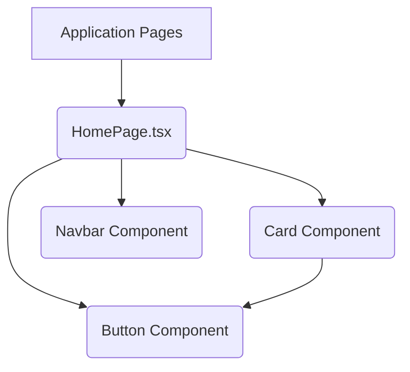

# Chapter 3: Reusable UI Components

Welcome back to our journey through the "learning" project! In the [Previous Chapter: Client-Server Architecture](chapter_02.md), we established the foundational split between our frontend and backend, understanding how they communicate to deliver a full-stack experience. Now, we'll dive deeper into the frontend's visual structure, exploring how we build the interactive and aesthetically pleasing parts of our application.

---

## The Problem: Inconsistent UIs and Slow Development

Imagine building a house brick by brick, but each brick is custom-made on the spot, with no standardized shape or size. The result would be a slow, inconsistent, and difficult-to-maintain structure. The same challenge arises in web development when user interface (UI) elements are created from scratch every time they are needed. Without a systematic approach, our "learning" application would suffer from:

*   **Inconsistency**: Buttons might look different on various pages, text styles could vary, and user experience would feel fragmented. This makes the application harder to learn and use.
*   **Slow Development**: Developers would spend valuable time recreating common elements instead of focusing on unique features. Every time a new page is built, basic UI elements like forms, navigation, or content displays would need to be re-coded.
*   **Maintenance Headaches**: If we decide to change the primary color of all buttons, we'd have to manually update dozens or hundreds of individual button instances across the entire codebase, leading to potential errors and missed updates.

**Concrete Use Case:** Consider a simple button. Our application will have many buttons: "Submit", "Cancel", "Enroll", "View Profile". If each of these is coded independently, we'll end up with slightly different styles, behaviors, and accessibility features, undermining the professional look and feel we aim for. Similarly, displaying learning courses or user profiles using "cards" would quickly become a repetitive and error-prone task without a unified approach.

---

## Core Concept: Building Blocks for Your UI

The solution to these challenges lies in **Reusable UI Components**. Think of them as standardized, pre-fabricated building blocks for your application's user interface. Just like LEGO bricks, these components are designed to be independent, focused on a single piece of UI, and capable of being assembled together to create more complex structures, like entire pages.

In the context of our "learning" project, reusable UI components are distinct, self-contained pieces of our frontend, built with React. This system ensures a consistent look and feel across the application while dramatically accelerating development. When we build a `Button` component once, we can use it everywhere a button is needed. If we need to change its styling, we update it in *one place*, and the change propagates across the entire application automatically. This approach fosters:

*   **Consistency**: All instances of a component will look and behave the same, creating a unified user experience.
*   **Efficiency**: Developers spend less time writing repetitive code and more time building new features.
*   **Maintainability**: Updates and bug fixes for UI elements can be applied globally from a single source.
*   **Scalability**: As the project grows, managing the UI becomes simpler and less prone to errors.

Key terminology we'll encounter includes:
*   **Component**: A self-contained, reusable piece of UI.
*   **Props (Properties)**: A way to pass data from a parent component to a child component, allowing for customization.
*   **State**: Data managed by a component that can change over time, typically influencing its rendering. (Though many reusable UI components are "stateless" or "presentational").

---

## Practical Usage Examples: From Buttons to Cards

Let's see how we use reusable UI components to solve our motivating use case. We'll start with a simple `Button` and then move to a more complex `Card` component, which might display a learning course.

### The `Button` Component

First, let's create a basic `Button` component that accepts text and an `onClick` handler.

```tsx
// src/components/ui/Button.tsx
import React from 'react';

interface ButtonProps {
  children: React.ReactNode;
  onClick: () => void;
  variant?: 'primary' | 'secondary' | 'danger'; // Optional styling variant
}

const Button: React.FC<ButtonProps> = ({ children, onClick, variant = 'primary' }) => {
  let baseClasses = "py-2 px-4 rounded font-semibold";
  let variantClasses = "";

  switch (variant) {
    case 'primary':
      variantClasses = "bg-blue-600 text-white hover:bg-blue-700";
      break;
    case 'secondary':
      variantClasses = "bg-gray-200 text-gray-800 hover:bg-gray-300";
      break;
    case 'danger':
      variantClasses = "bg-red-600 text-white hover:bg-red-700";
      break;
    default:
      variantClasses = "bg-blue-600 text-white hover:bg-blue-700";
  }

  return (
    <button className={`${baseClasses} ${variantClasses}`} onClick={onClick}>
      {children}
    </button>
  );
};

export default Button;
```
This code defines a `Button` component. It takes `children` (the text or elements inside the button), an `onClick` function, and an optional `variant` prop to control its appearance. We're using utility classes (like `bg-blue-600`) which is a common pattern with frameworks like Tailwind CSS, ensuring consistent styling based on the chosen variant.

Now, let's use this `Button` component in another part of our application:

```tsx
// src/pages/HomePage.tsx (example usage)
import React from 'react';
import Button from '../components/ui/Button'; // Import our reusable button

const HomePage: React.FC = () => {
  const handleEnrollClick = () => {
    alert('Enroll button clicked!');
  };

  const handleLearnMoreClick = () => {
    alert('Learn More clicked!');
  };

  return (
    <div className="p-4">
      <h1 className="text-3xl font-bold mb-4">Welcome to Learning!</h1>
      <p className="mb-4">Explore our courses and start your learning journey.</p>
      <div className="flex space-x-4">
        <Button onClick={handleEnrollClick} variant="primary">
          Enroll Now
        </Button>
        <Button onClick={handleLearnMoreClick} variant="secondary">
          Learn More
        </Button>
      </div>
    </div>
  );
};

export default HomePage;
```
Here, `HomePage` uses our `Button` component twice. Notice how we simply provide the `children` (text) and the `onClick` handler. Both buttons will have a consistent look and feel, but with different styles determined by the `variant` prop. If we decide to change the primary button color, we only modify `Button.tsx`.

---

### The `Card` Component

A `Card` component is excellent for displaying structured content like a course overview, a user profile, or an article preview.

```tsx
// src/components/ui/Card.tsx
import React from 'react';

interface CardProps {
  title: string;
  description: string;
  imageUrl?: string; // Optional image for the card
  actions?: React.ReactNode; // Optional actions (e.g., buttons)
}

const Card: React.FC<CardProps> = ({ title, description, imageUrl, actions }) => {
  return (
    <div className="bg-white rounded-lg shadow-md overflow-hidden transform transition duration-300 hover:scale-105">
      {imageUrl && (
        
      )}
      <div className="p-6">
        <h3 className="text-xl font-semibold mb-2 text-gray-900">{title}</h3>
        <p className="text-gray-600 text-sm mb-4">{description}</p>
        {actions && <div className="mt-4 flex space-x-2">{actions}</div>}
      </div>
    </div>
  );
};

export default Card;
```
This `Card` component is more complex. It takes `title`, `description`, an optional `imageUrl`, and an optional `actions` prop, which can be any React node (allowing us to embed buttons or links). The styling provides a nice visual presentation with a subtle hover effect.

Now, let's use the `Card` component to display a course on our `HomePage`:

```tsx
// src/pages/HomePage.tsx (extended example usage)
import React from 'react';
import Button from '../components/ui/Button';
import Card from '../components/ui/Card'; // Import our reusable card

const HomePage: React.FC = () => {
  const handleEnrollClick = () => alert('Enroll button clicked!');
  const handleViewCourseClick = () => alert('View Course clicked!');

  const course1 = {
    title: "Introduction to React",
    description: "Learn the fundamentals of building modern web applications with React.",
    imageUrl: "https://via.placeholder.com/400x200?text=React+Course"
  };

  return (
    <div className="p-4">
      <h1 className="text-3xl font-bold mb-4">Welcome to Learning!</h1>
      <p className="mb-4">Explore our courses and start your learning journey.</p>
      <div className="flex space-x-4 mb-8">
        <Button onClick={handleEnrollClick} variant="primary">Enroll Now</Button>
        <Button onClick={() => alert('Browse courses')} variant="secondary">Browse Courses</Button>
      </div>

      <h2 className="text-2xl font-bold mb-4">Featured Courses</h2>
      <div className="grid grid-cols-1 md:grid-cols-2 lg:grid-cols-3 gap-6">
        <Card
          title={course1.title}
          description={course1.description}
          imageUrl={course1.imageUrl}
          actions={
            <Button onClick={handleViewCourseClick} variant="primary">
              View Course
            </Button>
          }
        />
        {/* Imagine more cards for other courses here */}
      </div>
    </div>
  );
};

export default HomePage;
```
Here, we've integrated both the `Button` and `Card` components. The `Card` efficiently displays course information, and within its `actions` prop, we've embedded another `Button` component. This demonstrates how components can be composed and nested, building complex UIs from simpler, consistent parts.

---

## Internal Implementation Walkthrough: How Components Work

Let's dissect the internal workings of our `Button` and `Card` components to understand their structure and core principles.

### The Anatomy of a React Component File (`Button.tsx`)

A typical React component file, like `src/components/ui/Button.tsx`, follows a standard pattern:

1.  **Imports**: We import necessary modules, primarily `React` itself, and potentially specific hooks (`useState`, `useEffect`) or types.
    ```tsx
    // src/components/ui/Button.tsx
    import React from 'react'; // Imports the React library
    // ... other imports if needed
    ```
2.  **Interface Definition (Props)**: For type safety and clear documentation, we define an `interface` that specifies the *props* (properties) the component accepts. These props are the data passed from the parent component.
    ```tsx
    // src/components/ui/Button.tsx
    interface ButtonProps {
      children: React.ReactNode; // What's rendered inside the button
      onClick: () => void;      // Function to call when button is clicked
      variant?: 'primary' | 'secondary' | 'danger'; // Optional styling variant
    }
    ```
    This `ButtonProps` interface tells us exactly what kind of data the `Button` component expects. The `?` makes `variant` optional.
3.  **Component Function Definition**: The core of a functional React component is a JavaScript function that returns JSX (JavaScript XML), which looks like HTML. The function accepts `props` as its argument.
    ```tsx
    // src/components/ui/Button.tsx
    const Button: React.FC<ButtonProps> = ({ children, onClick, variant = 'primary' }) => {
      // Logic to determine classes based on variant
      let baseClasses = "py-2 px-4 rounded font-semibold";
      let variantClasses = "";
      switch (variant) { /* ... */ }

      return (
        <button className={`${baseClasses} ${variantClasses}`} onClick={onClick}>
          {children} {/* This is where the content (e.g., "Enroll Now") is rendered */}
        </button>
      );
    };
    ```
    Here, the `Button` function takes destructured `props` (`children`, `onClick`, `variant`). It then renders a native HTML `<button>` element. The `className` attribute applies CSS classes (likely from a framework like Tailwind CSS), and `onClick` hooks up the event handler.
4.  **Export**: Finally, the component is exported so it can be imported and used by other files.
    ```tsx
    // src/components/ui/Button.tsx
    export default Button; // Makes Button available for import
    ```

### How Data Flows (Props)

Props are the primary mechanism for components to communicate down the component tree. When `HomePage` uses `<Button onClick={...}>Enroll Now</Button>`, it's passing two props:
*   `onClick`: A function.
*   `children`: The string "Enroll Now".

The `Button` component then receives these props and uses them to render itself. This one-way data flow (parent to child) makes components predictable and easy to reason about.

### Styling with Utility-First CSS (e.g., Tailwind CSS)

While not explicitly part of the component structure, styling is crucial. In our examples, we've used classes like `bg-blue-600`, `text-white`, `rounded-lg`, etc. These are utility classes from a framework like Tailwind CSS. Instead of writing custom CSS for each component, we apply these pre-defined, single-purpose classes directly in our JSX. This approach helps maintain consistency and speeds up development.

---

### Component Composition and Nesting

The `Card` component demonstrates component composition:
*   It's a component itself.
*   It renders other elements like ``, `<h3>`, `<p>`.
*   Crucially, it can accept *other components* as part of its props, specifically via `actions`. When we pass `<Button ... />` into `Card`'s `actions` prop, the `Card` component renders that `Button` within its structure.

```mermaid
graph TD
    A[HomePage] -->|renders| B(Card Component)
    B -->|receives props: title, description, imageUrl, actions| C{Card's internal structure}
    C --> D[h3 (title)]
    C --> E[p (description)]
    C --> F[img (imageUrl)]
    C -->|renders actions prop| G(Button Component)
    G --> H[p (children: View Course)]
```
This diagram illustrates how `HomePage` renders a `Card`, which in turn renders a `Button` inside itself. This hierarchical structure is fundamental to building complex UIs with React.

---

## API & Interface Reference

For clarity and ease of use, let's formally define the interfaces for our example components.

### `Button` Component API

Located at `src/components/ui/Button.tsx`

```tsx
interface ButtonProps {
  /**
   * The content to be rendered inside the button (e.g., text, icons).
   */
  children: React.ReactNode;
  /**
   * Function to be called when the button is clicked.
   */
  onClick: () => void;
  /**
   * Defines the visual style of the button.
   * 'primary' for main actions, 'secondary' for alternative actions, 'danger' for destructive actions.
   * Defaults to 'primary'.
   */
  variant?: 'primary' | 'secondary' | 'danger';
}
```

**Usage Examples:**

```tsx
// Primary button
<Button onClick={() => console.log('Primary clicked')} variant="primary">
  Save Changes
</Button>

// Secondary button
<Button onClick={() => console.log('Secondary clicked')} variant="secondary">
  Cancel
</Button>

// Danger button
<Button onClick={() => console.log('Danger clicked')} variant="danger">
  Delete Account
</Button>
```

---

### `Card` Component API

Located at `src/components/ui/Card.tsx`

```tsx
interface CardProps {
  /**
   * The main title displayed on the card.
   */
  title: string;
  /**
   * A brief description or summary of the card's content.
   */
  description: string;
  /**
   * Optional URL for an image to be displayed at the top of the card.
   */
  imageUrl?: string;
  /**
   * Optional React node(s) to be displayed in the action area of the card (e.g., buttons, links).
   */
  actions?: React.ReactNode;
}
```

**Usage Examples:**

```tsx
// Basic Card
<Card
  title="Introduction to JavaScript"
  description="Master the fundamentals of JavaScript programming."
/>

// Card with image and actions
<Card
  title="Advanced React Patterns"
  description="Explore Hooks, Context, and performance optimization."
  imageUrl="https://via.placeholder.com/400x200?text=React+Patterns"
  actions={
    <Button onClick={() => alert('Start Course')} variant="primary">
      Start Course
    </Button>
  }
/>
```

---

## Configuration & Usage Patterns

Reusable components are not just about creating a single instance; it's about making them adaptable to different scenarios.

### Prop Variations and Defaults

As seen with the `Button`'s `variant` prop, components can have multiple visual configurations. Providing default values (e.g., `variant = 'primary'` in `Button.tsx`) ensures that the component works out of the box even if a prop is not explicitly passed.

```tsx
// Button with default primary variant (no variant prop needed)
<Button onClick={() => alert('Default button')}>Default Action</Button>
// Equivalent to: <Button onClick={() => alert('Default button')} variant="primary">Default Action</Button>
```

### Slot Pattern for Flexible Content

The `Card` component's `actions` prop demonstrates a "slot" pattern. Instead of expecting a specific type of content (like just a string), it expects `React.ReactNode`. This means you can pass anything: another component, an array of components, or even raw HTML elements. This makes the component highly flexible and reusable for various content structures.

```tsx
// Using multiple buttons in the actions slot
<Card
  title="My Profile"
  description="Manage your learning preferences and history."
  actions={
    <> {/* Using a React Fragment to group multiple elements */}
      <Button onClick={() => alert('Edit Profile')} variant="secondary">
        Edit
      </Button>
      <Button onClick={() => alert('View History')} variant="primary">
        View History
      </Button>
    </>
  }
/>
```

---

## System Integration: Components as the UI Backbone

Reusable UI components are the building blocks, but how do they fit into the larger project architecture?

### Composing Application Pages

The most direct integration is how components are used to compose the layouts and content of our [Application Pages and Navigation](chapter_04.md). Instead of crafting each page from raw HTML elements, we assemble pages using our custom `Button`, `Card`, `Navbar`, `Form` components, and more.


As this diagram shows, `HomePage` (an application page) uses multiple reusable components (`Card`, `Button`, `Navbar`) to construct its final appearance. This modularity makes pages easier to build, understand, and modify.

### Interaction with Frontend Data Management

Reusable components are often *presentational*. This means they focus on *how* things look, not *where* the data comes from or *how* it's managed. Data typically flows into these components via props. For instance, a `Card` displaying course details receives `title`, `description`, and `imageUrl` as props.

The actual fetching and management of this data is handled by our [Frontend Data Management](chapter_07.md) layer, likely using React Query. React Query fetches data from the [Server API and Routing](chapter_06.md), and then this data is passed down to the reusable components by their parent (often a page or a container component).

```mermaid
graph LR
    A[Frontend Data Management (React Query)] --> B{Container Component / Page}
    B -->|passes data as props| C(Reusable UI Component - e.g., Card)
    C --> D[Displays Data]
```
This separation of concerns is crucial: components render UI, while data management handles the data.

---

## Best Practices & Tips

Adopting reusable UI components effectively requires following certain best practices:

*   **Single Responsibility Principle**: Each component should ideally do one thing and do it well. A `Button` component should handle button logic and styling, not data fetching or complex routing.
*   **Presentational vs. Container Components**:
    *   **Presentational components** (like our `Button` and `Card`) are focused purely on UI. They receive data via props and generally have no internal state or knowledge of the application's business logic.
    *   **Container components** (often pages or more complex sections) manage state, fetch data, and pass it down to presentational components. This separation makes presentational components highly reusable.
*   **Props for Customization**: Design components to be flexible using props. The more configurable a component is via props, the more places it can be reused.
*   **Accessibility (a11y)**: Always consider accessibility. Use semantic HTML elements (`<button>`, `<a>`, `<input>`), provide appropriate `alt` text for images, and ensure keyboard navigability. Our `Button` example uses a native `<button>` element which provides basic accessibility out of the box.
*   **Consistent Naming Conventions**: Use clear, consistent names for components (e.g., `PascalCase` for component files and exports) and props. Group related components into logical directories (e.g., `src/components/ui`, `src/components/forms`).
*   **Avoid "Prop Drilling" (Advanced)**: While passing props down is fundamental, excessively passing props through many layers of components (prop drilling) can become cumbersome. For global or deeply nested data, consider React Context or state management libraries, but only when truly necessary. For simple UI components, prop drilling is usually fine.
*   **Documentation**: Even within the component file, add JSDoc-style comments to interfaces and props, explaining their purpose, type, and accepted values. This helps future developers (and your future self!) understand how to use the component.

### Common Pitfalls to Avoid:

*   **Over-engineering**: Don't make every small piece of UI a separate component if it's only used once and has no potential for reuse.
*   **Too many props**: If a component has an excessive number of props, it might be trying to do too much or needs to be broken down into smaller components.
*   **Direct DOM manipulation**: In React, avoid directly manipulating the DOM using `document.getElementById` or similar. React manages the DOM for you.

---

## Chapter Conclusion

In this chapter, we've explored the power of Reusable UI Components in our "learning" project. We started by understanding the problems of inconsistency and slow development, then introduced components as the fundamental building blocks that solve these issues. We walked through practical examples like `Button` and `Card`, dissected their internal structure, and learned how props enable customization and data flow. Finally, we saw how these components integrate with our application's pages and data management, laying a solid foundation for a consistent, maintainable, and scalable frontend.

With this understanding, you are now equipped to build vibrant and interactive user interfaces using a modular and efficient approach. Next, we'll see how these components are assembled into complete application views and how users navigate between them in [Chapter 4: Application Pages and Navigation](chapter_04.md).